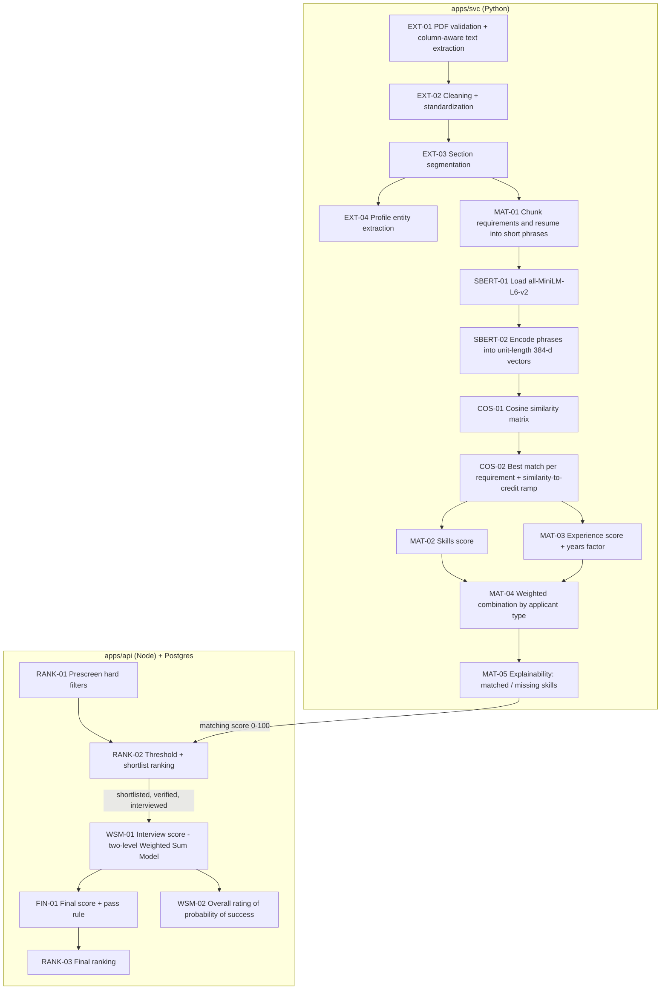

# VERA — Algorithms and Code Review Guide

> How VERA matches resumes to job descriptions with **Sentence-BERT + cosine similarity**, and how it turns interview ratings into a ranking with the **Weighted Sum Model**. Every step is tagged in the code with a `VERA-ALGO[ID]` marker so the panel can follow it line by line.
> Generated companions: [ALGORITHM_INDEX.md](./ALGORITHM_INDEX.md) (where each step lives) · [ALGORITHM_CODE.md](./ALGORITHM_CODE.md) (printable code handout).
> Related: [PRD](./PRD.md) BR-04..07 · [DATABASE_SCHEMA](./DATABASE_SCHEMA.md) §6 · Thesis Chapter 3 §3.3.

---

## 1. Pipeline at a glance



---

## 2. Algorithm registry

> **Solo sprint:** the matcher stays in `apps/svc/app/matchers/algorithm.py` (+ `rules.py`). The "Target location" column describes the post-defense module split (deferred, ROADMAP §6). During the sprint, `COS-01` is the explicit `cosine_similarity_matrix` function inside `algorithm.py` (added in S5). The "Tests" column lists the sprint test files.

`scripts/algo-map.mjs` reads **this table**. Keep one row per step. Status: `implemented` (code exists and is marked), `partial` (exists, needs the change in the Notes), `planned` (not built yet). `pnpm algo:check` fails if an `implemented`/`partial` step has no marker in the code.

| ID | Step | Status | Target location (after P4.1) | Today (uploaded code) | Thesis ref | Tests |
|---|---|---|---|---|---|---|
| `EXT-01` | PDF validation and column-aware text extraction | implemented | `apps/svc/app/validators/pdf.py`, `apps/svc/app/extractors/pdf_text.py` → `extract_page_text` | same | §3.3 text preprocessing | `tests/test_processing.py` |
| `EXT-02` | Text cleaning and standardization (spelling variants, spelled-out abbreviations) | implemented | `app/cleaners/text.py` → `normalize_whitespace`; `app/standardizers/resume.py` → `standardize_text` | same; applied to resumes (`/extract`) and job text (`/match`) | §3.3 text preprocessing | `tests/test_processing.py`, `tests/test_similarity.py` |
| `EXT-03` | Section segmentation (skills, experience, education…) | implemented | `app/extractors/sections.py` → `split_sections` | same | §3.3 section-based extraction | `tests/test_sections.py` |
| `EXT-04` | Profile entity extraction for the auto-filled card | implemented | `app/extractors/regex.py` → `extract_regex_entities`; `app/extractors/profile.py` → `build_profile`, `extract_education_level` | same | §3.3 information extraction | `tests/test_regex.py`, `tests/test_profile.py`, `tests/test_extract_endpoint.py` |
| `MAT-01` | Chunk job requirements and resume evidence into short phrases | implemented | `app/matchers/chunking.py` → `requirement_lines`, `prepare_resume` | `app/matchers/algorithm.py` → `_lines`, `_bullets`, `prepare_resume` | §3.3 input representation | `tests/test_matcher_math.py` |
| `SBERT-01` | Load the Sentence-BERT model (`SBERT_MODEL`, default all-MiniLM-L6-v2) | implemented | `app/matchers/embedding.py` → `load_model` | `algorithm.py` → `model_name`, `_get_model` | §3.3 Self-Attention | `tests/test_match_endpoint.py` (model name) |
| `SBERT-02` | Encode phrases into L2-normalized sentence embeddings | implemented | `app/matchers/embedding.py` → `encode` | `algorithm.py` → `embed` | §3.3 Pooling and Sentence Embedding | `tests/test_similarity.py` (real model, TC-70) |
| `COS-01` | Cosine similarity matrix (requirements × evidence) | implemented | `app/matchers/similarity.py` → `cosine_similarity_matrix` | `algorithm.py` → `cosine_similarity_matrix`, called by `_coverage` | §3.3 Cosine Similarity | `tests/test_similarity.py` (TC-68) |
| `COS-02` | Best match per requirement and similarity-to-credit ramp | implemented | `app/matchers/coverage.py` → `ramp`, `coverage` | `algorithm.py` → `ramp`, `_coverage` | §3.3 matching score | `tests/test_matcher_math.py` (TC-69) |
| `MAT-02` | Skills score | implemented | `app/matchers/scoring.py` → `skills_score` | `algorithm.py` → `skills_score` | §3.3 matching score | `tests/test_matcher_math.py` |
| `MAT-03` | Experience score with years-of-experience factor | implemented | `app/matchers/experience.py` → `experience_score`; `app/matchers/rules.py` → `total_years` | `algorithm.py` → `experience_score`; `rules.py` | §3.3 matching score | `tests/test_matcher_math.py`, `tests/test_rules.py` (TC-71) |
| `MAT-04` | Weighted combination by applicant type | implemented | `app/matchers/scoring.py` → `run_algorithm` | `algorithm.py` → `run_algorithm`; weights per type in `packages/shared/src/matching.js` → `MATCHING_WEIGHTS`, `resolveMatchingWeights` (sent by the API, S11) | §3.3 matching score | `tests/test_matcher_math.py`, `tests/test_match_endpoint.py`, `apps/api/tests/applications.test.js` (TC-32/33), `apps/api/tests/matchingWeights.test.js` |
| `MAT-05` | Explainability: matched and missing skills | implemented | `app/matchers/scoring.py` → `explain` | `algorithm.py` → `explain` | §3.3 explainability | `tests/test_matcher_math.py`, `tests/test_match_endpoint.py` |
| `RANK-01` | Prescreen hard filters (age, gender, education, height) | implemented | `apps/api/src/domain/prescreen.js` → `prescreen` | same (S11); called by `modules/applications/applications.service.js` | §3.3 / PRD FR-APP-03 | `apps/api/tests/prescreen.test.js` |
| `RANK-02` | Matching threshold and shortlist ranking per applicant type | implemented | `apps/api/src/domain/shortlist.js` → `refreshShortlist` | `shortlist.js` → `storedMatchingScore`, `meetsThreshold`, `compareCandidates`, `selectShortlist`, `refreshShortlist` (S11) | PRD BR-01, BR-05, BR-11, BR-12 | `apps/api/tests/shortlist.test.js` |
| `WSM-01` | Interview score: two-level Weighted Sum Model over the Competency Profile (15 items → 3 section % → weighted sum) | planned | `apps/api/src/domain/scoring.js` → `sectionScores`, `interviewScore` | — (S14); formula documented in §4 and on `final_evaluation.interview_score` | §3.3 Weighted Sum Model | `apps/api/tests/scoring.test.js` |
| `WSM-02` | Overall rating of probability of success (band of the interview score; informational) | partial | `supabase/migrations/20261007000000_competency_profile_rubric.sql` (`final_evaluation.overall_rating` generated column); `@vera/shared` → `successProbabilityFor` | SQL generated column + shared bands; evaluation UI in S14 | Competency Profile form | `apps/api/tests/competency-rubric.test.js` |
| `WSM-03` | Rating reuse: the 15 item ratings of the applicant's original interview × the new vacancy's section weights (no new interview) | partial | `apps/api/src/domain/reuse.js` → `reusedRatingsSource` (S12); `apps/api/src/domain/scoring.js` → `sectionScores` / `interviewScore` (S14) | source lookup implemented (S12, Resume Screening "Ratings on file"); scoring in S14 | §3.3 Weighted Sum Model | `apps/api/tests/reuse.test.js`; `apps/api/tests/scoring.test.js` (S14) |
| `FIN-01` | Final score and pass rule | partial | `apps/api/src/domain/scoring.js` → `finalScore`; `supabase/migrations/…_initial_schema.sql` (`final_evaluation` generated columns) | SQL only | §3.3 composite score | `apps/api/tests/scoring.test.js` |
| `RANK-03` | Final ranking per vacancy | planned | `apps/api/src/modules/vacancies/vacancies.repository.js` → `findRanking` | — | PRD FR-END-01 | `apps/api/tests/ranking.test.js` |
| `RANK-04` | Rematch ranking after a client rejection: keep final ≥ passing; order matching DESC, final DESC, vacancy id ASC | planned | `apps/api/src/domain/rematch.js` → `rankRematch` | — (planned for S17); rule in PRD BR-23 | PRD FR-END-10 | `apps/api/tests/rematch.test.js` |

---

## 3. Marker convention (how the code is highlighted)

Wrap each step in a BEGIN/END pair. The tag must come **right after** the comment symbol so editors and the scanner can find it.

```python
# VERA-ALGO[COS-01] BEGIN Cosine similarity matrix between requirements and resume evidence
# Formula: cos(a, b) = (a · b) / (‖a‖ · ‖b‖)      Ref: docs/ALGORITHM.md §4 COS-01
def cosine_similarity_matrix(a: np.ndarray, b: np.ndarray) -> np.ndarray:
    ...
# VERA-ALGO[COS-01] END
```
```js
// VERA-ALGO[WSM-01] BEGIN Interview score (two-level Weighted Sum Model)
// Formula: Sₛ = (mean rating of section s − 1) / 4 × 100;  I = Σ wₛ · Sₛ / 100, Σ wₛ = 100        Ref: docs/ALGORITHM.md §4 WSM-01
export function interviewScore(weights, ratings) { ... }
// VERA-ALGO[WSM-01] END
```
```sql
-- VERA-ALGO[FIN-01] BEGIN Final score = plain average of matching and interview scores
...
-- VERA-ALGO[FIN-01] END
```

**Rules**
1. IDs come from the registry above. New step → add a registry row first.
2. A block covers the smallest code that implements the step: the function plus any constants it needs.
3. The line after BEGIN states the formula (or rule) and `Ref: docs/ALGORITHM.md §4 <ID>`.
4. One ID may appear in more than one place (e.g. `FIN-01` in JS and SQL). Blocks of the same ID must not nest.
5. Moving or refactoring code → move the markers with it, then run `pnpm algo:check`.
6. Library code (inside `sentence-transformers`) is **not** marked; we mark where we call it and how we configure it (§5).

**Tooling**

| Command | Does |
|---|---|
| `pnpm algo:check` | Validates markers vs the registry (balanced BEGIN/END, known IDs, every implemented/partial step present). Exit code 1 on problems. |
| `pnpm algo:map` | Regenerates `docs/ALGORITHM_INDEX.md` with file and line links. |
| `pnpm algo:snippets` | Also regenerates `docs/ALGORITHM_CODE.md`, the printable handout of every block in pipeline order. |
| VS Code + Todo Tree | `.vscode/settings.json` highlights every `VERA-ALGO` line in yellow on navy and lists all blocks in the Todo Tree sidebar. |

---

## 4. Step-by-step

Notation: requirement phrases **J** = {j₁ … jₘ}, resume evidence phrases **E** = {e₁ … eₙ}, embedding function **f**.

### EXT-01 … EXT-04 — Extraction
1. **EXT-01** Validate the upload (PDF, ≤ 10 MB, has meaningful text). Extract text page by page; `extract_page_text` detects two-column layouts and reads the left column before the right so sentences are not interleaved.
2. **EXT-02** Normalize whitespace and standardize spelling variants and spelled-out abbreviations (e.g. "Node js" → "Node.js", "point-of-sale" → "POS") so the same skill is written one way. It runs on the resume (`/extract`) **and** on the job requirements (`/match`). Why the abbreviation rule: the model scores "POS system operation" vs "point-of-sale terminal" only ≈ 0.22 (below `LOW`, no credit) but vs "POS terminal" ≈ 0.65.
3. **EXT-03** Split the text into sections by heading (summary, experience, education, skills, certifications…). Matching uses only **skills** and **experience**.
4. **EXT-04** Extract profile fields to pre-fill the profile card (`app/extractors/profile.py → build_profile`): name, contact, birthdate (→ `YYYY-MM-DD`; numeric dates read as MM/DD/YYYY), gender, height (→ cm; 1 ft = 30.48 cm, 1 in = 2.54 cm), address line (house no./street/barangay before the city), city, province, and **education level** (the highest level found; degree abbreviations and SHS strand names count only inside the education section and never as "MS Office/Word/Excel…"; "Doctor" counts only as "Doctor of …"/"Doctorate"; an in-progress degree counts one level lower; an old-curriculum "High School" counts as `senior_high`, PRD FR-PROF-02). These fields are **never** used in the matching score; they are only used by prescreening after the applicant confirms them.

### MAT-01 — Chunking
SBERT works best on short phrases, and all-MiniLM-L6-v2 truncates input after 256 word pieces. Comparing a whole resume against a whole job description would also hide *which* requirement matched.
- Job: `required_skills` → one phrase per line/comma; `experience_requirement` → job title + one phrase per duty sentence.
- Resume: every skills-section phrase gets evidence weight **1.0**; every bullet in the experience section is also skill evidence with weight **0.90** (`BULLET_DISCOUNT`, a skill only implied by a duty is weaker evidence); experience lines are kept separately for MAT-03.
- Date-range lines are removed; duplicates are dropped (case-insensitive).

### SBERT-01 / SBERT-02 — Sentence embeddings
`f(x)` is Sentence-BERT **all-MiniLM-L6-v2** (configurable with `SBERT_MODEL`, §5): a 6-layer MiniLM transformer → mean pooling → L2 normalization → a **384-dimensional** vector.
- Self-attention inside each layer: `Attention(Q, K, V) = softmax(QKᵀ / √dₖ) V` (inside the library).
- Mean pooling over the token vectors hₜ: `u = (1/T) Σₜ hₜ` (inside the library).
- Normalization: `v = u / ‖u‖` (we request it with `normalize_embeddings=True`).
- The model is loaded once at service start (FastAPI lifespan) and embeddings are cached per distinct phrase.

### COS-01 — Cosine similarity
```
cos(jᵢ, eₖ) = ( f(jᵢ) · f(eₖ) ) / ( ‖f(jᵢ)‖ · ‖f(eₖ)‖ )        range −1 … 1
```
Computed for all pairs at once as a matrix **S** (m × n). Because the vectors are unit length, the denominator is 1 and **S = F_J · F_Eᵀ**; `cosine_similarity_matrix` still keeps the norms explicit so the code reads exactly like the formula and stays correct if normalization is ever turned off (a zero vector gives 0, never a division error):
```python
def cosine_similarity_matrix(a, b):
    a_norm = np.linalg.norm(a, axis=1, keepdims=True)
    b_norm = np.linalg.norm(b, axis=1, keepdims=True)
    return (a @ b.T) / np.clip(a_norm @ b_norm.T, 1e-12, None)
```

### COS-02 — Best match and credit
For each requirement, take its best-matching evidence after applying evidence weights:
```
bᵢ = maxₖ ( Sᵢₖ · wₖ )
cᵢ = clip( (bᵢ − LOW) / (HIGH − LOW), 0, 1 )      LOW = 0.35, HIGH = 0.65
```
Below 0.35 the phrases are treated as unrelated (credit 0); above 0.65 as a clear paraphrase (credit 1); linear in between. This removes the noise floor of raw cosine values (unrelated short phrases still score around 0.1–0.3).

### MAT-02 — Skills score
`S_skills = (1/m) Σᵢ cᵢ` over the job's skill phrases.

### MAT-03 — Experience score
- Relevance: the same coverage as COS-02 between the job's experience phrases and the resume's experience lines (no evidence weights): `R = (1/m′) Σ cᵢ′`.
- Years worked `Y`: date ranges in the experience section are parsed and **merged** (overlaps counted once) — `rules.py → total_years`.
- With a minimum `N > 0`: `S_exp = R · ( 0.60 + 0.40 · min(Y / N, 1) )` (`EXP_YEARS_SHARE = 0.40`). Years only help if the experience is relevant; with 0 years the experience score is capped at 60% of its relevance. With `N = 0`: `S_exp = R`.
- **Empty job text (svc behavior, unchanged):** when the job has no experience phrases (m′ = 0), `_coverage` returns `R = 1.0` (there is nothing left to match), whatever the resume contains. So with `N = 0` the svc reports `S_exp = 1.0`, and with `N > 0` the score depends on years only: `0.60 + 0.40 · min(Y / N, 1)`. The API avoids giving that 1.0 any weight when the job has no experience criterion (MAT-04 rule below).

### MAT-04 — Weighted combination by applicant type
```
matching = 100 · ( w_s · S_skills + w_e · S_exp ) / ( w_s + w_e )
first-time job seeker:  w_s = 1,   w_e = 0      → skills only
experienced applicant:  w_s = 0.5, w_e = 0.5
no experience criterion (experience text blank AND N = 0):  w_s = 1, w_e = 0 for every applicant type
```
The result is rounded to 2 decimals (`matching_result.matching_score` is `numeric(5,2)`). This combination is itself a Weighted Sum Model over two criteria (skills, experience), the same WSM described in Chapter 3 §3.3.5. The API chooses the weights with `resolveMatchingWeights(applicantType, vacancy)` (`packages/shared/src/matching.js`) from the applicant's radio-button choice, sends them to `/match`, and stores the weights actually used in `matching_result.weights`.

**Why the no-experience rule:** a vacancy without experience text and without minimum years gives the svc nothing to compare, so `S_exp = 1.0` (MAT-03). At 0.5 / 0.5 that would hand every Experienced applicant a free 50-point floor (`matching = 50 + 0.5 · S_skills`): they could never fall below a threshold of 40, and they would outrank First-time applicants with the same skills. Matching such a vacancy on skills only scores both groups by the one criterion the job actually states. A vacancy with experience text, or with minimum years > 0 (even with blank text), keeps 0.5 / 0.5.

### MAT-05 — Explainability
```
matched = { jᵢ : cᵢ > 0 }      missing = { jᵢ : cᵢ = 0 }
```
For each requirement: the best evidence phrase, its similarity, and its credit (`skillMatches`), plus `matchedSkills` / `missingSkills` from `explain`. Shown in **View matching details**.

### RANK-01 — Prescreen
Hard filters from the confirmed profile: age range (age computed from birthdate, inclusive limits), gender requirement (`any` always passes), minimum education level (ordered enum, "at least"), minimum height (a profile without a height fails a set minimum). An unset condition always passes. Failing any → `prescreen_failed`, the svc is not called, and the notification names every unmet condition (the posting never shows age or gender, RA 10911). Prescreen fields never enter any score.

### RANK-02 — Threshold and shortlist
```
stored = round₂(matchScore)                (hundredths, half-up: 39.995 → 40.00)
below_threshold  ⇔  stored < threshold     (default 40)
open slots = 2 × slots − occupied          (occupied = locked shortlisted + past-screening; from S17, rematch applications excluded)
shortlist  = top open-slots candidates by matching DESC, applied_at ASC, application_id ASC
```
The score from `/match` is rounded **once**, stored in `matching_result.matching_score`, and the threshold is checked on that stored value. Otherwise the application enters the waiting pool and its group's shortlist is refreshed under the vacancy row lock: candidates are the `waiting_pool` and unlocked `shortlisted` applications of that group, **every** application included (invitations and applications whose ratings will be reused compete like the rest, PRD BR-21); the top ones become `shortlisted` and the remaining unlocked shortlisted go back to `waiting_pool`. Slots locked by verification (`verification_started_at`) are never displaced (DATABASE_SCHEMA §6.2). The ranking is sorted in JS (`compareCandidates`) so it can be read and tested. Refresh moves are recorded as system changes (`changed_by` null, reason "shortlist refresh"). The application cap counts qualified applications only (not `prescreen_failed` / `below_threshold`; PRD FR-APP-07).

### RANK-04 — Rematch ranking *(planned for S17; PRD BR-23)*
After a client rejection (`not_hired`), every open vacancy is a candidate unless it is at a failed company (BR-19), its endorsement is full, or prescreen (RANK-01) fails. For each remaining vacancy:
```
M  = round₂(/match score)  with MAT-04 weights of the CARRIED-OVER applicant type      (RANK-02 storedMatchingScore)
     excluded if M < threshold                                                         (RANK-02 meetsThreshold)
I  = WSM-01(original interview ratings via WSM-03, THIS vacancy's section weights)
F  = (M + I) / 2, half-up hundredths                                                   (FIN-01)
keep F ≥ passing score of THIS vacancy
order: M DESC, then F DESC, then vacancy_id ASC   →  rank 1 is suggested to HR
```
Matching decides first (the vacancy that fits the resume best), the final score breaks ties, and the vacancy id makes the order deterministic. Every matched vacancy is stored with its numbers (`excluded_reason` for those below the threshold or passing score), so the suggestion can be explained. **RANK-02 change (S17):** accepted rematch applications start at `for_endorsement` and do not count as occupied shortlist slots.

### WSM-01 — Interview score (two-level Weighted Sum Model)
The rubric is the agency's **Competency Profile**: 3 sections, 15 items. HR rates **every item** `r ∈ {1…5}` in every interview (so the ratings can be reused with another vacancy's weights). The vacancy weights the **sections** `wₛ` (percent, Σ wₛ = 100; a section may be 0%).

| Section | Items (each rated 1–5) |
|---|---|
| **A. Communication and Interpersonal Skills** | Oral Communication/Listening · Co-Worker Relations/Teamwork · Customer Relations |
| **B. Personal Effectiveness Skills and Traits** | Problem Solving · Time Management · Quality · Initiative and Perseverance · Personal Integrity · Adaptability · Stress Tolerance · Self-Development · Commitment |
| **C. Job Specific Skills and Experience** | Experience · Education / Training · Technical Skills |

Level 1 — each section's score, from the mean of its item ratings (1 → 0%, 3 → 50%, 5 → 100%):
```
Sₛ = ( mean(rᵢ, i ∈ s) − 1 ) / 4 × 100
```
Level 2 — the weighted sum of the section scores:
```
interview = Σₛ wₛ · Sₛ / 100          range 0 … 100
```
**Exact rounding (identical in JS and SQL).** Work in hundredths with integers and round half-up (for these non-negative values, Postgres `round()` behaves the same):
- section hundredths `hₛ = round_half_up( (Σrᵢ − n) × 2500 / n )` (n = items in the section) → `Sₛ = hₛ / 100` (2 dp; stored in `final_evaluation.section_scores`);
- interview hundredths `= round_half_up( Σₛ round(wₛ × 100) × hₛ / 10000 )` → `interview` (2 dp).

The rating interpretations shown next to the 1–5 buttons:

| Rating | Interpretation |
|---|---|
| 1 | Does not achieve expectations / Major development need |
| 2 | Partially achieves expectations / Development need |
| 3 | Achieves expectations / Neither strength nor development need |
| 4 | Exceeds expectations / Strength |
| 5 | Greatly exceeds expectations / Major strength |

For an applicant whose ratings are reused (WSM-03), `r` are the 15 ratings of their original interview and `wₛ` the **new** vacancy's section weights.

### WSM-03 — Rating reuse (no new interview)
PRD BR-21 *(decided Oct 7, 2026)*: an applicant with a completed evaluation from an earlier application is not interviewed again.
```
source  = ratings_source_application_id of the applicant's most recent completed final_evaluation
r       = the 15 competency_rating rows of `source`        (the original interview)
wₛ      = section weights of the NEW vacancy
I       = WSM-01(r, wₛ)                                     (same formula, new weights)
final   = (M_new + I) / 2;   passed = final ≥ passing score of the new vacancy      (FIN-01)
```
- **Why follow `ratings_source_application_id`:** a reused evaluation has no `competency_rating` rows of its own. Its `ratings_source_application_id` already points at the interviewed application, so taking it from the most recent evaluation resolves any chain of reuses (Cashier interview → Store Crew reuse → a third vacancy) to the original interview in one step. The new evaluation stores the same id.
- The most recent completed evaluation is used even if it was `did_not_pass`.
- Matching is **never** reused: `M_new` is this application's own `/match` score (BR-20).
- Shortlisting (RANK-02) and document screening still apply; only interview scheduling and rating are skipped. HR starts the computation (**Compute final score (reused ratings)**) after verification.

### WSM-02 — Overall rating of probability of success
Automatic and **informational only** (pass/fail is still FIN-01). A band of the interview score:

| Interview score | Overall rating of probability of success |
|---|---|
| 80–100 | **5** — HIGH — Very good probability of success (80–100%) |
| 60–<80 | **4** — Good probability of success (60–80%) |
| 40–<60 | **3** — MODERATE — Moderate probability of success with adequate training and coaching (40–60%) |
| 20–<40 | **2** — Poor probability of success; training unlikely to correct problem areas (20–40%) |
| 0–<20 | **1** — LOW — Very poor probability of success; training extremely unlikely to correct problem areas (0–20%) |

Stored as the generated column `final_evaluation.overall_rating` (same thresholds as `@vera/shared` `SUCCESS_PROBABILITY_BANDS`, checked by a test).

### FIN-01 — Final score and pass rule
```
final  = (matching + interview) / 2          (= WSM with weights 0.5 / 0.5)
passed = final ≥ passing_score
```
Enforced twice: `scoring.js → finalScore` (shown in the UI before saving) and the `final_evaluation` generated columns (the stored truth). Both round to 2 decimals.

### RANK-03 — Final ranking
Combined groups per vacancy: `final DESC, matching DESC, applied_at ASC` (DATABASE_SCHEMA §6.4).

---

## 5. Parameters

| Name | Value | Where | Why |
|---|---|---|---|
| Model | `SBERT_MODEL` in `apps/svc/.env`, default `all-MiniLM-L6-v2` (384-d) | `SBERT-01` | small, fast on CPU, strong sentence-similarity benchmark results. A copy in `app/matchers/model/` is loaded instead (offline) when present. Another model changes the vector size and the similarity scale: re-tune `LOW`/`HIGH` and re-run the tests. The name is returned with every result (`modelName`). |
| Abbreviation map | `point-of-sale` / `point of sale` → `POS` | `EXT-02` | the model scores the spelled-out form ≈ 0.22 against "POS"; standardizing both texts restores the match (≈ 0.65) |
| `LOW`, `HIGH` | 0.35, 0.65 | `COS-02` | similarity-to-credit ramp; starting values, tuned on the validation set in P10.3 |
| `BULLET_DISCOUNT` | 0.90 | `MAT-01` | skill found only in a duty bullet |
| `EXP_YEARS_SHARE` | 0.40 | `MAT-03` | share of the experience score that depends on years |
| Weights first-time / experienced | (1, 0) / (0.5, 0.5); (1, 0) for both when the vacancy has no experience criterion (blank experience text and 0 minimum years) — `MATCHING_WEIGHTS` / `resolveMatchingWeights` in `@vera/shared`, sent by the API to `/match` | `MAT-04` | PRD BR-04 |
| Matching threshold | 40 (per vacancy), compared with the stored score rounded to 2 dp half-up | `RANK-02` | PRD BR-05 |
| Rubric | Competency Profile: 3 sections (A 3 items, B 9, C 3) | `WSM-01` | the agency's interview form; HR rates all 15 items |
| Rating scale | 1–5 per item; section % = (mean − 1) / 4 × 100 | `WSM-01` | PRD BR-06 |
| Section weights | per vacancy, 0–100 each, total 100 | `WSM-01` | PRD FR-VAC-01 |
| Rounding | 2 dp, half-up, computed in exact hundredths (`apps/api/src/domain/round.js`) | `RANK-02`, `WSM-01`, `FIN-01` | same numbers in JS, SQL, and the UI |
| Probability bands | 80 / 60 / 40 / 20 → ratings 5 / 4 / 3 / 2, else 1 | `WSM-02` | Competency Profile form; informational |
| Final score weights | 0.5 / 0.5 | `FIN-01` | PRD BR-07 |

Changing any value = update this table, the CHANGELOG, and the tests in the same PR.

---

## 6. Worked example (use it as the unit-test fixture)

Vacancy **Cashier**, min 1 year. Required skills: *Cash handling · POS system operation · Customer service · Issuing receipts*. Experience: *Cashier · Process cash and cashless payments · Balance the cash drawer*. Section weights: A 30%, B 30%, C 40%. Passing score 75.

The similarity values below are **illustrative** (chosen to show the math); the real values come from the model.

| Skill requirement | best evidence | bᵢ | credit cᵢ = clip((b − 0.35)/0.30) |
|---|---|---|---|
| Cash handling | "Cash handling" | 0.92 | 1.000 |
| POS system operation | "POS system" | 0.71 | 1.000 |
| Customer service | "Customer service" | 0.88 | 1.000 |
| Issuing receipts | "Processed … and issued receipts" (×0.90 already applied) | 0.50 | 0.500 |

- `S_skills = (1 + 1 + 1 + 0.5) / 4 = 0.875`
- Experience relevance: b = 0.80, 0.66, 0.55 → c = 1, 1, 0.667 → `R = 0.8889`
- Years `Y = 0.5`, `N = 1` → `S_exp = 0.8889 × (0.60 + 0.40 × 0.5) = 0.7111`
- **Experienced:** `matching = 100 × (0.5 × 0.875 + 0.5 × 0.7111) = 79.31`
- **First-time:** `matching = 100 × 0.875 = 87.50`
- Item ratings: A = 5, 4, 4 · B = 4, 4, 4, 4, 5, 4, 3, 4, 4 · C = 4, 4, 4
- Section scores: A mean 4.3333 → (4.3333 − 1)/4 × 100 = **83.33%** (hundredths: 10 × 2500 / 3 = 8333.3 → 8333); B mean 4 → **75.00%**; C mean 4 → **75.00%**
- `interview = 30 × 83.33/100 + 30 × 75/100 + 40 × 75/100 = 25.00 + 22.50 + 30.00 = 77.50` (hundredths: (3000×8333 + 3000×7500 + 4000×7500) / 10000 = 7749.9 → 7750)
- Overall rating of probability of success: 77.50 → **4** (Good, 60–80%)
- **Final (experienced):** `(79.31 + 77.50) / 2 = 78.405 → 78.41` (half-up) → passed (≥ 75)
- **Final (first-time):** `(87.50 + 77.50) / 2 = 82.50` → passed

**Rating reuse (WSM-03) on Store Crew (ClayGo).** Section weights A 20%, B 80%, C 0%; passing 75. The same applicant applies after the Cashier application ends; the ratings above are reused, matching is computed fresh.
- Section scores are unchanged (same ratings): A **83.33%**, B **75.00%**, C **75.00%**
- `interview = 20 × 83.33/100 + 80 × 75/100 + 0 × 75/100 = 16.67 + 60.00 + 0 = 76.67` (hundredths: (2000×8333 + 8000×7500 + 0×7500) / 10000 = 7666.6 → 7667)
- Overall rating of probability of success: 76.67 → **4** (Good)
- New matching against Store Crew (illustrative): `M_new = 80.00` → **Final:** `(80.00 + 76.67) / 2 = 78.335 → 78.34` (half-up) → passed (≥ 75)
- Same ratings, different weights: Cashier 77.50, Store Crew 76.67. The ratings carry over; the vacancy decides how much each section counts.

**Rematch (RANK-04, planned for S17).** Juan is endorsed for Cashier and Kabayan Mart rejects him (`not_hired`). The rescan:
- Every Kabayan Mart vacancy → excluded before matching (failed company, BR-19).
- Store Crew (ClayGo): open, prescreen passes, endorsement 0 of 1 → matched as **Experienced** (carried over); `M = 80.00` (illustrative) ≥ 40; `I = 76.67` (above); `F = (80.00 + 76.67) / 2 = 78.34` ≥ 75 → kept.
- An illustrative second open vacancy with `M = 85.00` but `F = 72.40` against a passing score of 75 → stored with `excluded_reason = below_passing`.
- Ranking: Store Crew is rank 1 → **suggested** to HR with matching 80.00 and final 78.34. If HR offers and Juan accepts, his Store Crew application starts at `for_endorsement` with `final_evaluation.ratings_source_application_id` = the Cashier interview.

Tests: `apps/svc/tests/test_matcher_math.py` injects these similarity values (fixture `fake_similarity` in `tests/conftest.py`) in place of SBERT + `cosine_similarity_matrix` and asserts 0.875 / 0.7111 / 79.31 / 87.50; `tests/test_match_endpoint.py` asserts the same numbers through `POST /match`; `apps/api/tests/scoring.test.js` asserts 83.33 / 75 / 75, 77.50, rating 4, 78.41, 82.50, and the reuse example 76.67 / 78.34 plus a reuse chain resolving to the original interview (S14).

---

## 7. Defense code-review walkthrough (≈ 10 minutes)

1. Open `docs/ALGORITHM_INDEX.md` — show that every step has a file and line range.
2. `apps/svc/app/api/match.py` → `POST /match` — the entry point the API calls with the stored sections (no PDF re-upload); the job text goes through `EXT-02` first.
3. `MAT-01` chunking → why short phrases.
4. `SBERT-01`/`SBERT-02` → model load + `encode(normalize_embeddings=True)`; run `print(model)` to show *Transformer → Pooling(mean) → Normalize* and `get_sentence_embedding_dimension() == 384`.
5. `COS-01` → the formula line and the matrix code.
6. `COS-02` → `argmax`, `ramp`.
7. `MAT-02`, `MAT-03`, `MAT-04` → scores and weights by applicant type.
8. `apps/api/src/modules/applications/applications.service.js` → prescreen (`RANK-01`), svc call, threshold and shortlist (`RANK-02`).
9. `WSM-01`, `WSM-02`, `FIN-01` → the Competency Profile (15 items → 3 section % → weighted sum), the overall-rating band, and the SQL generated columns side by side.
10. Run the worked-example tests live: `pnpm --filter svc test -- -k "matcher_math or match_endpoint"` and `pnpm --filter api test scoring`.

Print `docs/ALGORITHM_CODE.md` (`pnpm algo:snippets`) as the handout.

---

## 8. Likely panel questions

| Question | Short answer |
|---|---|
| Why SBERT and not TF-IDF? | TF-IDF only matches identical words; SBERT matches meaning ("Cash handling" vs "Handled cash" ≈ 0.90, vs "welding" ≈ 0.14 with all-MiniLM-L6-v2). Abbreviations are a known weak spot ("POS" vs "point-of-sale" ≈ 0.22), which EXT-02 handles by standardizing both texts. Chapter 3 compares TF-IDF, SBERT, and a cross-encoder: unlike a cross-encoder, SBERT encodes each text separately, so job and resume embeddings are computed once and reused across many applicants. |
| Why cosine similarity? | It compares direction, not length, so phrase length does not inflate the score; SBERT is trained so that cosine reflects semantic similarity. |
| Your code multiplies vectors — where is the cosine? | Embeddings are normalized to length 1, so the dot product *is* the cosine; `cosine_similarity_matrix` keeps the norms explicit to show the formula. |
| Why compare phrase by phrase? | Model input limit (256 word pieces), less dilution, and per-requirement explanations (matched/missing skills). |
| Where do 0.35 and 0.65 come from? | Calibration of the cosine noise floor and paraphrase level; tuned on our labeled validation set (P10.3) and reported with the results. |
| Why do first-time job seekers get skills only? | They have no work history to compare; scoring experience would rank them at zero by design. They are also ranked in a separate group. |
| Does the system use age or gender in scoring? | No. Those are vacancy prescreen conditions set by HR; matching and interview scores never use them. |
| Is the result deterministic? | Yes, for the same model version and inputs. The model name is stored with every result. |
| Does a high score hire someone? | No. Scores rank and explain; HR verifies, interviews, and the client decides. |
| How fast is it? | Model loaded once; embeddings cached; one match is an m × n matrix of a few dozen phrases — well under a second on CPU after warm-up. |
