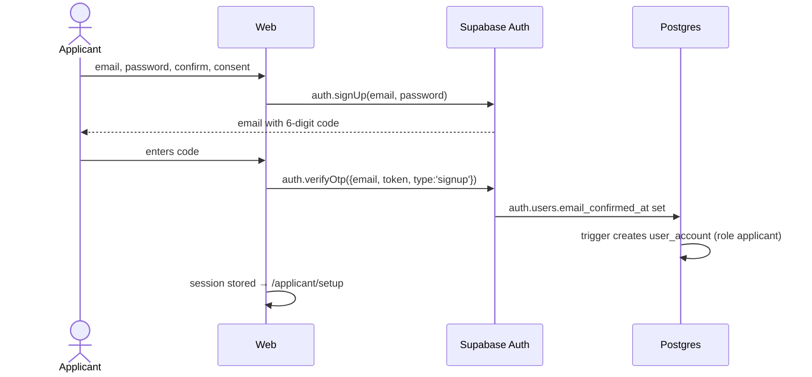
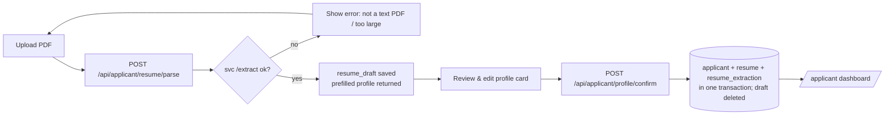
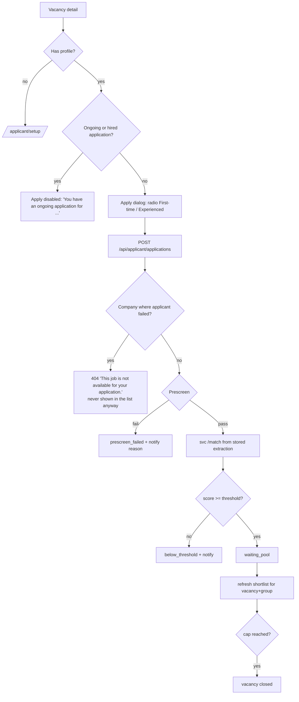
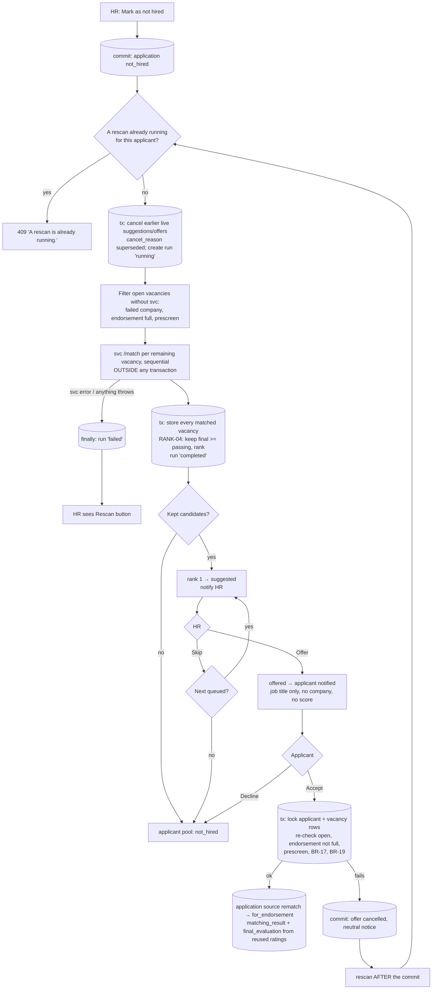
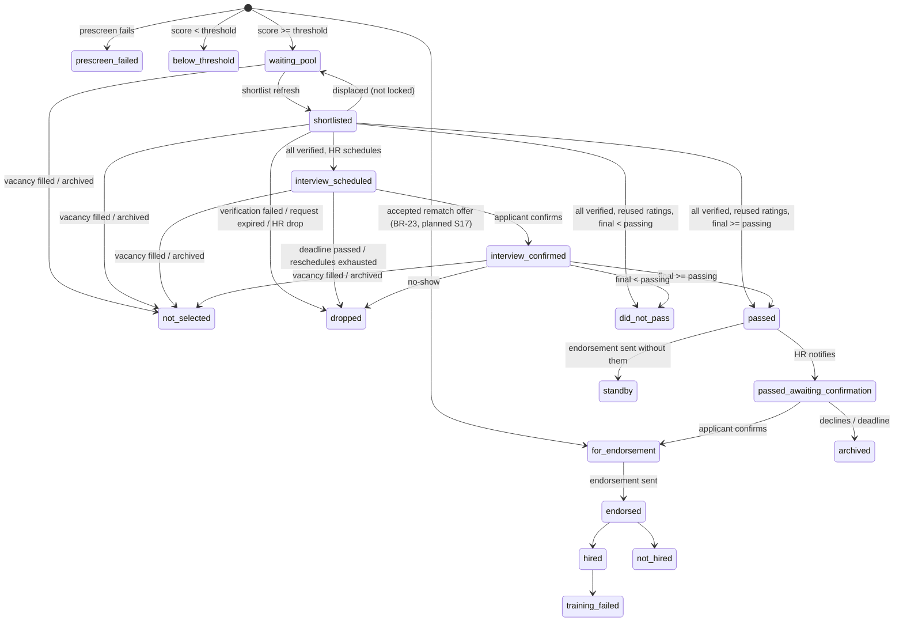

# VERA — App Flow

> How users move through VERA: routes, screens, flows, and state machines.
> Requirements live in [PRD](./PRD.md); endpoints in [TRD](./TRD.md) §6; tables in [DATABASE_SCHEMA](./DATABASE_SCHEMA.md).

---

## 1. Route map (`apps/web`)

### 1.1 Public
| Route | Screen | Notes |
|---|---|---|
| `/login` | Login | email/password, remember me, forgot password, Google, link to sign up |
| `/signup` | Applicant sign-up | email, password, confirm, privacy consent |
| `/signup/verify` | Enter 6-digit code | resend code (60 s cooldown) |
| `/forgot-password` | Request reset link | |
| `/reset-password` | Set new password | opened from the email link |
| `/auth/callback` | OAuth / email link landing | resolves session, then role redirect |

### 1.2 Applicant (`role = applicant`)
| Route | Screen | Sidebar |
|---|---|---|
| `/applicant/setup` | Upload resume → review profile → confirm | (sidebar disabled until done) |
| `/applicant` | Dashboard (profile card, status panel, interview, notifications) | My Profile |
| `/applicant/jobs` | Job Vacancies list | Job Vacancies |
| `/applicant/jobs/:vacancyId` | Vacancy detail + Apply | Job Vacancies |
| `/applicant/documents` | My Documents (Resume tab, Supporting tab, Requests) | My Documents |
| `/applicant/notifications` | All notifications | (bell in header) |

### 1.3 Admin / HR (`role = admin | hr`)
| Route | Screen | Sidebar |
|---|---|---|
| `/admin` | Dashboard | Dashboard |
| `/admin/companies` · `/admin/companies/:id` | Company List · Company detail | Company List |
| `/admin/vacancies` · `/admin/vacancies/new` · `/admin/vacancies/:id` · `/admin/vacancies/:id/edit` | Vacancies · form · detail (ranking) | Job Vacancies |
| `/admin/applicants` · `/admin/applicants/:id` | Applicant Management · applicant detail | Applicant Management |
| `/admin/screening` · `/admin/screening/:vacancyId` · `/admin/screening/:vacancyId/:applicationId` | Resume Screening | Resume Screening |
| `/admin/interviews` · `/admin/interviews/:vacancyId` | Interview Assessment | Interview Assessment |
| `/admin/endorsements` · `/admin/endorsements/:vacancyId` | Endorsement Management: tabs Candidates · Outcomes · Post-hiring | Endorsement Management |
| `/admin/talent-pool` | Applicant Pool (talent pool): tabs Waiting · Invited | Applicant Pool |
| `/admin/reports` | Recruitment Reports *(optional, P9.6)* | Recruitment Reports |
| `/admin/settings` | Deadlines & defaults | Settings |
| `/admin/users` | HR accounts (**admin only**) | User Management |
| `/admin/competencies` | Fixed competency list (**admin only**) | Competencies |
| `/admin/notifications` | All notifications | (bell in header) |

Route guards: `RequireAuth` → `RequireRole(['applicant'])` / `RequireRole(['admin','hr'])` → (applicant only) `RequireProfile` (redirects to `/applicant/setup` if no profile).

---

## 2. Authentication flows

### 2.1 Sign-up with code
> *Sprint (ROADMAP S6, simplified):* Supabase emails a confirmation **link** instead of a code. The link opens `/auth/callback` → session → `/applicant/setup`; if it opens in another browser or device, the page says "Your email is confirmed. Please log in." (TRD §7.2).


### 2.2 Login and role redirect
1. `supabase.auth.signInWithPassword` (or `signInWithOAuth({provider:'google'})` → `/auth/callback`).
2. Storage chosen by **Remember me**: checked → `localStorage`; unchecked → `sessionStorage`.
3. Web calls `GET /api/me` → `{ role, account_status, hasProfile }`.
4. Inactive → sign out + message. `admin|hr` → `/admin`. `applicant` → `/applicant` or `/applicant/setup`.

### 2.3 Forgot password
`/forgot-password` → `auth.resetPasswordForEmail(email, { redirectTo: <origin>/reset-password })` → email link → `/reset-password` → `auth.updateUser({ password })` → `/login`.

---

## 3. Applicant flows

### 3.1 First-time setup


### 3.2 Apply
One ongoing application at a time (BR-17); vacancies of a company where the applicant failed are hidden (BR-19); every application gets fresh matching (BR-20).


### 3.3 Respond to requests
- **Document request** (dashboard action card + My Documents → Requests): upload the requested type before `due_at`.
- **Interview** (pop-up): *Confirm* or *Request reschedule* (reason). Shows meeting link once confirmed.
- **Endorsement confirmation** (pop-up): *Confirm* or *Decline*.
- **Suggested vacancy** *(S17, to be revised)*: HR offers a vacancy from the applicant pool; the applicant accepts or declines. Accepting starts a normal application (§3.2).

### 3.4 Replace resume (My Documents → Resume tab)
Allowed only if no active application. Upload → parse → review profile diff (current vs extracted) → confirm → old resume archived/deleted → verification reset.

### 3.5 Applicant status panel (dashboard)
One row per application: vacancy title, applicant type, applied date, **stage label** (mapping in §6), next action + deadline if any. While one row is ongoing or hired, the job list and job detail show why Apply is unavailable (BR-17).

### 3.6 Applying again after an unsuccessful application
After a final outcome other than `hired` the applicant may apply elsewhere (BR-18). Outcome classes (BR-19):

| Class | Statuses | Effect |
|---|---|---|
| ongoing | waiting_pool, shortlisted, interview_scheduled, interview_confirmed, passed, passed_awaiting_confirmation, for_endorsement, endorsed | blocks applying |
| hired | hired | blocks applying until training_failed |
| failed | did_not_pass, not_hired, training_failed, dropped | frees the applicant **and** hides every vacancy of that company from them |
| neutral | prescreen_failed, below_threshold, not_selected, standby, archived, terminated | frees the applicant, no company block |

If the applicant has a completed evaluation, the new application reuses its 15 ratings (BR-21, §4.2).

### 3.7 Automatic rematch after a client rejection *(planned, S17; PRD BR-23)*

**Rules that keep svc calls out of transactions:**
- **Rescan:** the not_hired transaction commits first. The rescan runs afterwards: a short transaction creates the run, then the svc calls happen with no transaction open, then a second transaction stores the results.
- **Accept that fails a re-check:** the cancellation is committed first; the rescan runs after that commit.
- **Close-out** (BR-22) runs inside the fill/archive transaction. It only cancels the vacancy's live candidates (`cancel_reason` `vacancy_filled`) and **returns the affected applicant ids**; the caller runs one rescan per applicant after the commit.

**Concurrency:**
- One rescan at a time per applicant: a partial unique index on `rematch_run (applicant_id) where status = 'running'`. A second start → 409 "A rescan is already running."
- The run is set to `failed` in a `finally` block if anything throws, so it never stays `running`.
- Starting a run first cancels any live (`suggested` / `offered`) candidates from the applicant's earlier runs (`cancel_reason` `superseded`).
- Accept locks the applicant row and the vacancy row (same order as S11b apply).
- A pending offer is not ongoing (BR-17). If the applicant applies elsewhere, the apply transaction cancels it (`applied_elsewhere`) and notifies HR.

**Rematch candidate states:** `queued` → `suggested` → `skipped` | `offered` → `accepted` | `declined`; any live state → `cancelled` (`vacancy_filled`, `endorsement_full`, `applied_elsewhere`, `superseded`). Vacancies below the threshold or passing score are stored with `excluded_reason` and no state.

---

## 4. HR / Admin flows

### 4.1 Vacancy setup
Company List → add company (if new) → Job Vacancies → **New vacancy** (multi-section form: Details · Requirements · Prescreen · Pipeline · Competencies & weights) → save as draft → **Find matches in talent pool** (optional, invite) → **Publish**.

### 4.2 Resume screening
```mermaid
flowchart LR
  L[Pick vacancy] --> G[Tabs: Experienced | First-time\nshortlist = top 2×slots by matching score]
  G --> D[Open applicant]
  D --> V[Verify resume + each document]
  V -->|first action| LK[verification_started_at set → slot locked]
  V --> RQ{Need a document / new copy?}
  RQ -- yes --> RQ2[Request with reason, due in 3 days] --> W[Wait]
  W -->|uploaded| V
  W -->|expired| DR[dropped → next moves up]
  V -->|all verified, no earlier evaluation| SC[Schedule interview]
  SC --> IS[interview_scheduled → leaves screening]
  V -->|all verified, earlier evaluation on file| RU[Compute final score - reused ratings]
  RU --> FE[passed / did_not_pass → ranking, no interview]
```
**Rating reuse (BR-21, S12/S14):** the review sheet shows "Ratings on file from {job} ({company}), {date}". Once the resume and documents are verified, HR clicks **Compute final score (reused ratings)** instead of Schedule interview: the earlier 15 item ratings (followed to the original interview) × this vacancy's section weights → interview score; final = (this application's matching + interview) ÷ 2.

### 4.3 Interview assessment
Combined list (both groups). Columns: applicant, group, matching score, interview status, scheduled time, attempts used. Applicants whose ratings are reused (BR-21) are never interviewed again and do not appear here; confirming an interview no longer touches other applications (BR-17).
- **Schedule** (date/time, duration, link, interviewer) → applicant has 3 days to confirm.
- **Reschedule requested** → HR sets new time (attempt + 1, max 3 total).
- **Mark no-show** → `dropped`.
- **Evaluate** (after interview) → rate all active competencies 1–5 (weighted ones highlighted, weights shown) → live preview of interview score and final score → **Save** → `passed` / `did_not_pass`.

### 4.4 Ranking, notify, endorsement
Vacancy detail → **Final ranking** tab (combined) → select passed applicants up to endorsement count → **Notify** (editable message) → applicants confirm → Endorsement Management → review list → **Generate form** (PDF + XLSX) → preview → **Send to company** (prefilled contact email) and/or **Download** → remaining `passed` → `standby` (talent pool).

### 4.5 Outcomes and post-hiring
Endorsement Management → per endorsed applicant: **Hired** / **Not hired** (+ optional client interview date, remarks).
Hired → **Post-hiring details** form → **Send**. Later: **Training failed** → talent pool.
Hired count = slots → vacancy `filled`.

### 4.6 Applicant pool and rematch suggestions *(planned, S17)*
- **Applicant Pool** list (reason, last scores, ratings on file).
- **Suggestions** (BR-23, §3.7): per rejected applicant, the current suggestion with job, company, matching score, and final score → **Offer to applicant** / **Skip**. Failed rescans show **Rescan**.
- Manual HR invitations are deferred (ROADMAP §6); pooled applicants apply by themselves with rating reuse (BR-21).

---

## 5. State machines

### 5.1 Application

- Every application starts with prescreen and fresh matching (BR-20). There is no "→ `terminated`" any more: one ongoing application per applicant (BR-17) leaves nothing to terminate; the value stays for old rows.
- **Close-out** (BR-22, S15/S16): when a vacancy becomes `filled` or `archived`, `waiting_pool` / `shortlisted` / `interview_*` → `not_selected` and `passed` → `standby`. A cap-close or HR pause keeps the waiting pool.
- Any open interview attempt is `cancelled` when its application is dropped or not selected.
- Applicant pool is entered from: `did_not_pass`, `standby`, `not_hired`, `training_failed`, `not_selected`.
- Outcome classes (ongoing / hired / failed / neutral): §3.6.

### 5.2 Vacancy

```mermaid
stateDiagram-v2
  [*] --> draft
  draft --> open: publish (weights = 100)
  open --> closed: cap reached / HR pauses
  closed --> open: HR reopens (applications < cap; may raise the cap)
  open --> endorsing: first endorsement sent
  closed --> endorsing: first endorsement sent
  endorsing --> filled: hired = slots
  endorsing --> open: all failed, pool empty, HR reopens
  filled --> [*]
  draft --> archived
  closed --> archived
```


### 5.3 Interview attempt
`pending_confirmation` → `confirmed` → `completed` | `no_show`
`pending_confirmation` → `reschedule_requested` → (HR) `rescheduled` + new attempt
`pending_confirmation` → `expired` (deadline) · any open → `cancelled` (application dropped or not selected)

---

## 6. Applicant-facing stage labels

Every final status except `hired` has the next action "You can apply to other jobs" (BR-18).

| Status | Label shown to applicant | Next action |
|---|---|---|
| prescreen_failed | Not qualified | You can apply to other jobs |
| below_threshold | Not shortlisted | You can apply to other jobs |
| waiting_pool | Application received | — |
| shortlisted | Under review | Upload requested documents (until S12 adds document requests: "Wait for the agency to review your application") |
| interview_scheduled | Interview scheduled | Confirm or reschedule |
| interview_confirmed | Interview confirmed | Attend online interview |
| did_not_pass | Not selected (kept in applicant pool) | You can apply to other jobs |
| passed | Under final review | — |
| passed_awaiting_confirmation | Passed — confirm endorsement | Confirm or decline |
| for_endorsement / endorsed | For client interview | Wait for agency update |
| hired | Hired | Read post-hiring details |
| not_hired / standby / training_failed | Kept in applicant pool | You can apply to other jobs |
| not_selected | Not selected (kept in applicant pool) | You can apply to other jobs |
| terminated | Closed (you continued with another job) — old rows only | You can apply to other jobs |
| dropped | Closed (no response) | You can apply to other jobs |
| archived | Closed (endorsement declined) | You can apply to other jobs |

---

## 7. Scheduled jobs (every 15 minutes, `apps/api/src/jobs`)

| Job | Does |
|---|---|
| `expire-document-requests` | pending requests past `due_at` → `expired`; application → `dropped`; refresh shortlist |
| `expire-interview-confirmations` | `pending_confirmation` past `confirm_due_at` → `expired`; application → `dropped`; refresh shortlist |
| `expire-endorsement-confirmations` | `passed_awaiting_confirmation` with `action_due_at` in the past → `archived` |
| `expire-pool-invitations` | pending invitations past `due_at` → `expired` |
| `send-interview-reminders` | confirmed interviews within `interview_reminder_hours` and no reminder yet |
| `send-pending-emails` | notifications with `email_status = 'pending'` → send, retry failed up to 3 times |
| `purge-stale-drafts` | `resume_draft` older than 24 h → delete row + file |
