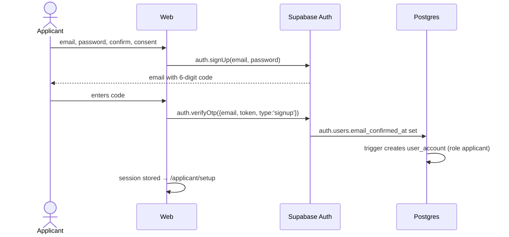
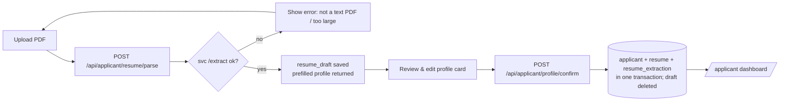
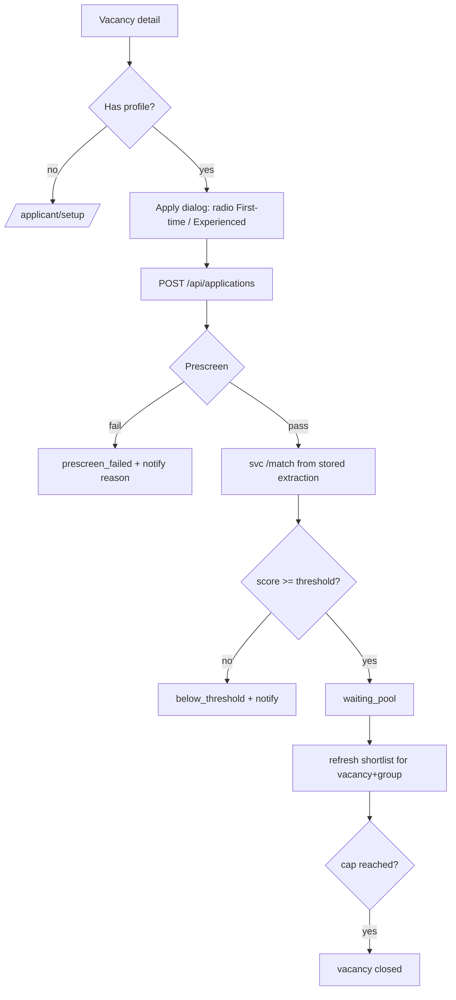
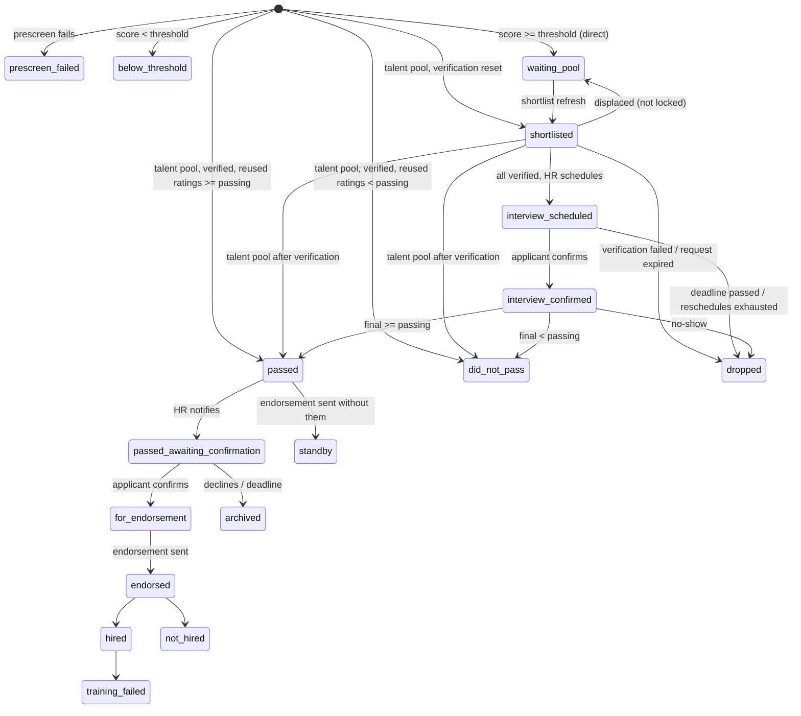
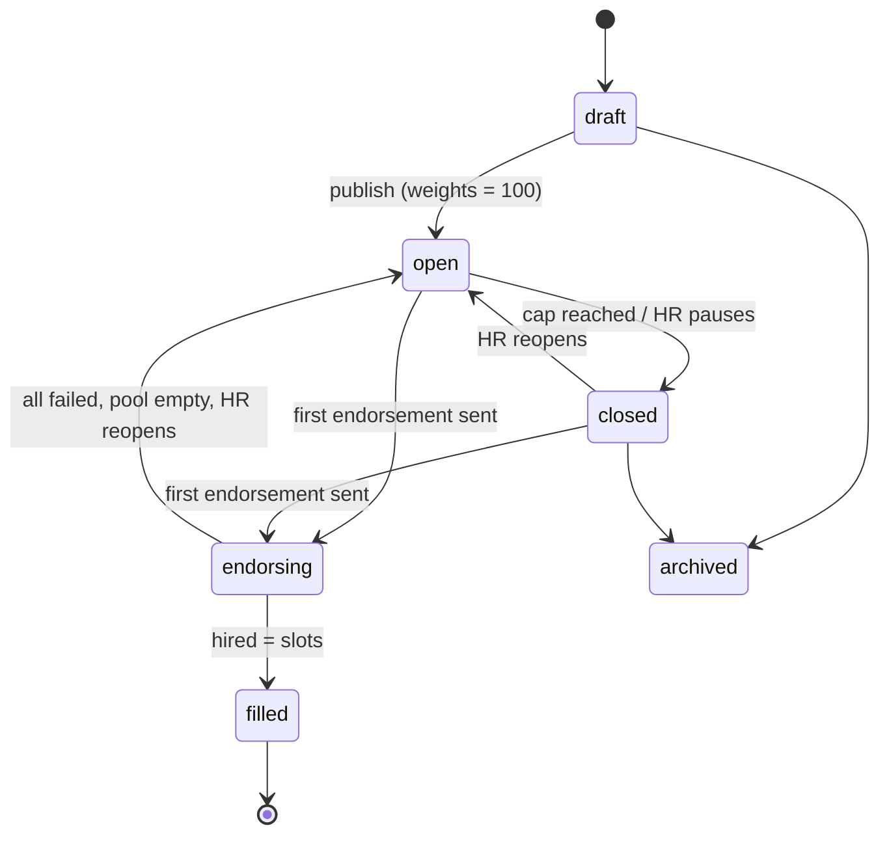

# VERA — App Flow

> How users move through VERA: routes, screens, flows, and state machines.
> Requirements live in [PRD](./PRD.md); endpoints in [TRD](./TRD.md) §6; tables in [DATABASE_SCHEMA](./DATABASE_SCHEMA.md).

---

## 1. Route map (`apps/web`)

### 1.1 Public
| Route | Screen | Notes |
|---|---|---|
| `/login` | Login | email/password, remember me, forgot password, Google, link to sign up |
| `/signup` | Applicant sign-up | email, password, confirm, privacy consent |
| `/signup/verify` | Enter 6-digit code | resend code (60 s cooldown) |
| `/forgot-password` | Request reset link | |
| `/reset-password` | Set new password | opened from the email link |
| `/auth/callback` | OAuth / email link landing | resolves session, then role redirect |

### 1.2 Applicant (`role = applicant`)
| Route | Screen | Sidebar |
|---|---|---|
| `/applicant/setup` | Upload resume → review profile → confirm | (sidebar disabled until done) |
| `/applicant` | Dashboard (profile card, status panel, interview, notifications) | My Profile |
| `/applicant/jobs` | Job Vacancies list | Job Vacancies |
| `/applicant/jobs/:vacancyId` | Vacancy detail + Apply | Job Vacancies |
| `/applicant/documents` | My Documents (Resume tab, Supporting tab, Requests) | My Documents |
| `/applicant/notifications` | All notifications | (bell in header) |

### 1.3 Admin / HR (`role = admin | hr`)
| Route | Screen | Sidebar |
|---|---|---|
| `/admin` | Dashboard | Dashboard |
| `/admin/companies` · `/admin/companies/:id` | Company List · Company detail | Company List |
| `/admin/vacancies` · `/admin/vacancies/new` · `/admin/vacancies/:id` · `/admin/vacancies/:id/edit` | Vacancies · form · detail (ranking) | Job Vacancies |
| `/admin/applicants` · `/admin/applicants/:id` | Applicant Management · applicant detail | Applicant Management |
| `/admin/screening` · `/admin/screening/:vacancyId` · `/admin/screening/:vacancyId/:applicationId` | Resume Screening | Resume Screening |
| `/admin/interviews` · `/admin/interviews/:vacancyId` | Interview Assessment | Interview Assessment |
| `/admin/endorsements` · `/admin/endorsements/:vacancyId` | Endorsement Management: tabs Candidates · Outcomes · Post-hiring | Endorsement Management |
| `/admin/talent-pool` | Applicant Pool (talent pool): tabs Waiting · Invited | Applicant Pool |
| `/admin/reports` | Recruitment Reports *(optional, P9.6)* | Recruitment Reports |
| `/admin/settings` | Deadlines & defaults | Settings |
| `/admin/users` | HR accounts (**admin only**) | User Management |
| `/admin/competencies` | Fixed competency list (**admin only**) | Competencies |
| `/admin/notifications` | All notifications | (bell in header) |

Route guards: `RequireAuth` → `RequireRole(['applicant'])` / `RequireRole(['admin','hr'])` → (applicant only) `RequireProfile` (redirects to `/applicant/setup` if no profile).

---

## 2. Authentication flows

### 2.1 Sign-up with code


### 2.2 Login and role redirect
1. `supabase.auth.signInWithPassword` (or `signInWithOAuth({provider:'google'})` → `/auth/callback`).
2. Storage chosen by **Remember me**: checked → `localStorage`; unchecked → `sessionStorage`.
3. Web calls `GET /api/me` → `{ role, account_status, hasProfile }`.
4. Inactive → sign out + message. `admin|hr` → `/admin`. `applicant` → `/applicant` or `/applicant/setup`.

### 2.3 Forgot password
`/forgot-password` → `auth.resetPasswordForEmail(email, { redirectTo: <origin>/reset-password })` → email link → `/reset-password` → `auth.updateUser({ password })` → `/login`.

---

## 3. Applicant flows

### 3.1 First-time setup


### 3.2 Apply


### 3.3 Respond to requests
- **Document request** (dashboard action card + My Documents → Requests): upload the requested type before `due_at`.
- **Interview** (pop-up): *Confirm* or *Request reschedule* (reason). Shows meeting link once confirmed.
- **Endorsement confirmation** (pop-up): *Confirm* or *Decline*.
- **Pool invitation** (notification): opens the vacancy → normal Apply.

### 3.4 Replace resume (My Documents → Resume tab)
Allowed only if no active application. Upload → parse → review profile diff (current vs extracted) → confirm → old resume archived/deleted → verification reset.

### 3.5 Applicant status panel (dashboard)
One row per application: vacancy title, applicant type, applied date, **stage label** (mapping in §6), next action + deadline if any.

---

## 4. HR / Admin flows

### 4.1 Vacancy setup
Company List → add company (if new) → Job Vacancies → **New vacancy** (multi-section form: Details · Requirements · Prescreen · Pipeline · Competencies & weights) → save as draft → **Find matches in talent pool** (optional, invite) → **Publish**.

### 4.2 Resume screening
```mermaid
flowchart LR
  L[Pick vacancy] --> G[Tabs: Experienced | First-time\nshortlist = top 2×slots by matching score]
  G --> D[Open applicant]
  D --> V[Verify resume + each document]
  V -->|first action| LK[verification_started_at set → slot locked]
  V --> RQ{Need a document / new copy?}
  RQ -- yes --> RQ2[Request with reason, due in 3 days] --> W[Wait]
  W -->|uploaded| V
  W -->|expired| DR[dropped → next moves up]
  V -->|all verified| SC[Schedule interview]
  SC --> IS[interview_scheduled → leaves screening]
```

### 4.3 Interview assessment
Combined list (both groups). Columns: applicant, group, matching score, interview status, scheduled time, attempts used.
- **Schedule** (date/time, duration, link, interviewer) → applicant has 3 days to confirm.
- **Reschedule requested** → HR sets new time (attempt + 1, max 3 total).
- **Mark no-show** → `dropped`.
- **Evaluate** (after interview) → rate all active competencies 1–5 (weighted ones highlighted, weights shown) → live preview of interview score and final score → **Save** → `passed` / `did_not_pass`.

### 4.4 Ranking, notify, endorsement
Vacancy detail → **Final ranking** tab (combined) → select passed applicants up to endorsement count → **Notify** (editable message) → applicants confirm → Endorsement Management → review list → **Generate form** (PDF + XLSX) → preview → **Send to company** (prefilled contact email) and/or **Download** → remaining `passed` → `standby` (talent pool).

### 4.5 Outcomes and post-hiring
Endorsement Management → per endorsed applicant: **Hired** / **Not hired** (+ optional client interview date, remarks).
Hired → **Post-hiring details** form → **Send**. Later: **Training failed** → talent pool.
Hired count = slots → vacancy `filled`.

### 4.6 Talent pool
Filter by reason, education, location, last final score. Actions: view profile + ratings, **Invite to vacancy**, mark unavailable. From a vacancy: **Find matches in talent pool** (ranked by computed matching score, prescreen + threshold applied).

---

## 5. State machines

### 5.1 Application

- **Any active status** (`waiting_pool` … `endorsed`) → `terminated` when the applicant confirms an interview for another vacancy.
- Any open interview attempt is `cancelled` when its application is terminated or dropped.
- Talent pool is entered from: `did_not_pass`, `standby`, `not_hired`, `training_failed`.

### 5.2 Vacancy


### 5.3 Interview attempt
`pending_confirmation` → `confirmed` → `completed` | `no_show`
`pending_confirmation` → `reschedule_requested` → (HR) `rescheduled` + new attempt
`pending_confirmation` → `expired` (deadline) · any open → `cancelled` (application terminated/dropped)

---

## 6. Applicant-facing stage labels

| Status | Label shown to applicant | Next action |
|---|---|---|
| prescreen_failed | Not qualified | — |
| below_threshold | Not shortlisted | — |
| waiting_pool | Application received | — |
| shortlisted | Under review | Upload requested documents |
| interview_scheduled | Interview scheduled | Confirm or reschedule |
| interview_confirmed | Interview confirmed | Attend online interview |
| did_not_pass | Not selected (kept in applicant pool) | — |
| passed | Under final review | — |
| passed_awaiting_confirmation | Passed — confirm endorsement | Confirm or decline |
| for_endorsement / endorsed | For client interview | Wait for agency update |
| hired | Hired | Read post-hiring details |
| not_hired / standby / training_failed | Kept in applicant pool | — |
| terminated | Closed (you continued with another job) | — |
| dropped | Closed (no response) | — |
| archived | Closed (endorsement declined) | — |

---

## 7. Scheduled jobs (every 15 minutes, `apps/api/src/jobs`)

| Job | Does |
|---|---|
| `expire-document-requests` | pending requests past `due_at` → `expired`; application → `dropped`; refresh shortlist |
| `expire-interview-confirmations` | `pending_confirmation` past `confirm_due_at` → `expired`; application → `dropped`; refresh shortlist |
| `expire-endorsement-confirmations` | `passed_awaiting_confirmation` with `action_due_at` in the past → `archived` |
| `expire-pool-invitations` | pending invitations past `due_at` → `expired` |
| `send-interview-reminders` | confirmed interviews within `interview_reminder_hours` and no reminder yet |
| `send-pending-emails` | notifications with `email_status = 'pending'` → send, retry failed up to 3 times |
| `purge-stale-drafts` | `resume_draft` older than 24 h → delete row + file |
