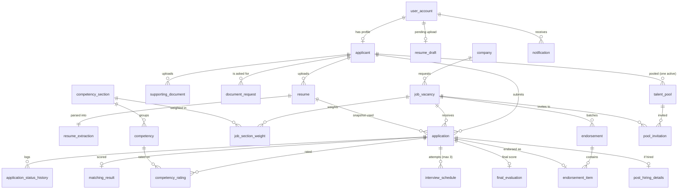

# VERA — Database Schema

> **Source of truth:** `supabase/migrations/20261006000000_initial_schema.sql`
> If this document and the SQL disagree, the SQL wins. Update both in the same PR.
> Related: [PRD](./PRD.md) · [TRD](./TRD.md) · [APP_FLOW](./APP_FLOW.md)

---

## 1. Conventions

| Rule | Example |
|---|---|
| Table names are **singular** snake_case | `application`, `supporting_document` |
| Primary key is `<table>_id`, type `uuid` (default `gen_random_uuid()`) | `application_id` |
| `user_account_id` **equals** `auth.users.id` (Supabase Auth) | — |
| Timestamps are `timestamptz`, named `*_at` | `created_at`, `verified_at`, `due_at` |
| Every mutable table has `updated_at`, maintained by a trigger | `set_updated_at()` |
| Scores are `numeric(5,2)` on a **0–100** scale | `matching_score = 72.50` |
| Status columns use Postgres **enums** | `application_status` |
| Age is **never stored**; it is computed from `birthdate` | `v_applicant_profile.age` |
| Ranks are **never stored**; they are computed with window functions | see §6 |
| Files live in Supabase Storage; tables store the **path** only | `resumes/<applicant_id>/<uuid>.pdf` |
| Schema changes = **new migration file**. Never edit an applied migration | — |

---

## 2. Entity Relationship Diagram



---

## 3. Table reference

### 3.1 Accounts

**`user_account`** — one row per Supabase Auth user, created by trigger **only after the email is confirmed**.
- `role` ∈ `admin | hr | applicant`. Set from `auth.users.raw_app_meta_data.vera_role` (only the service role can write app_metadata). Default `applicant`.
- `auth_provider` ∈ `email | google`. `full_name` is for staff.
- No `username` / `password_hash`: Supabase Auth owns credentials.

### 3.2 Applicant side

**`applicant`** — the confirmed profile. Created only when the applicant confirms the auto-filled card.
- Fields: names, `suffix`, `contact_number`, `birthdate`, `gender`, `height_cm` (optional), `address_line`, `city` (municipality), `province`, `education_level`.
- Age: `v_applicant_profile.age`.

**`resume_draft`** — holds an uploaded PDF + svc extraction between *upload & parse* and *confirm*. One row per user, replaced on every parse, deleted on confirm. Used for first setup **and** resume replacement.

**`resume`** — the applicant's resume versions. Exactly **one** `is_current = true` per applicant (partial unique index).
- Replacing: if the old resume is referenced by any `application`, set `is_current=false, archived_at=now()`; otherwise delete row + file.
- Replacement is **blocked** while the applicant has an active application (`is_active_application_status`).
- A new resume starts with `verification_status = 'pending'` (verification reset).

**`resume_extraction`** — 1:1 with `resume`. Stores `standardized_text`, `sections` (jsonb), `skills_text`, `experience_text`, `years_experience`, `extracted_profile` (for audit of the auto-fill), `warnings`. Matching runs from this row, so the PDF is never re-sent to the svc.

**`supporting_document`** — per applicant (not per application), so verification carries across applications. `document_type` cannot be `resume`. Re-upload: the old row gets `is_current=false, replaced_at`.

**`document_request`** — HR asks for a document or a new copy, with a mandatory `reason` and a `due_at` (default 3 days). `document_type='resume'` means resume re-upload. Fulfilled by `fulfilled_document_id` or `fulfilled_resume_id`. Expired by the scheduler.

### 3.3 Companies and vacancies

**`company`** — client company (name, industry, description, website) + contact person (name, position, email, number). Name unique (case-insensitive).

**`competency_section`** — the 3 Competency Profile sections: `section_code` A (Communication and Interpersonal Skills), B (Personal Effectiveness Skills and Traits), C (Job Specific Skills and Experience). *(migration 20261007000000, S9b)*

**`competency`** — the 15 Competency Profile **items** (`section_id`, `sort_order`): A = Oral Communication/Listening, Co-Worker Relations/Teamwork, Customer Relations; B = Problem Solving, Time Management, Quality, Initiative and Perseverance, Personal Integrity, Adaptability, Stress Tolerance, Self-Development, Commitment; C = Experience, Education / Training, Technical Skills. Seeded by the migration and `supabase/seed.sql`.

**`job_vacancy`** — the manpower request as a posting.
- Matcher inputs: `required_skills` (one per line), `experience_requirement` (title on line 1, duties after), `min_years_experience`.
- Prescreen (hard filters): `min_age`, `max_age`, `gender_requirement`, `min_education_level`, `min_height_cm`.
- Pipeline config: `slots_needed`, `shortlist_per_group` (**generated** = slots × 2), `application_cap` (≥ slots × 4), `endorsement_count` (≥ slots), `matching_threshold` (default 40), `passing_score`.
- `status` ∈ `draft | open | closed | endorsing | filled | archived`. Applicants only see `open`; they never see `company`.

**`job_section_weight`** — one row per vacancy × section with `weight` (%, 0–100; 0 allowed). A **deferred constraint trigger** enforces that a vacancy's weights total exactly 100 (or 0 while a draft has none). The API additionally requires 100 before publishing and stores all 3 sections once any weight is set. Replaces `job_competency` (dropped in S9b; old weights were summed into sections).

### 3.4 Pipeline

**`application`** — one per applicant × vacancy (**unique**, so no re-applying).
- `applicant_type` from the radio button; `resume_id` = the resume used at apply time.
- `application_source` = `direct | talent_pool`; `source_application_id` points to the earlier application whose ratings are reused.
- `verification_started_at` locks the applicant's shortlist slot (§6.2).
- `action_due_at` is the deadline for the applicant's pending action on the application itself (endorsement confirmation). Document requests, interviews, and invitations carry their own deadlines.
- Every status change is written to **`application_status_history`** by trigger. The API sets `SET LOCAL vera.actor_id = '<uuid>'` per transaction so `changed_by` is recorded (null = system job).

**`matching_result`** — 1:1 with application. `matching_score` (0–100), sub-scores, matched/missing skills, `weights` used (`{"skills":1,"experience":0}` for first-time, `{"skills":0.5,"experience":0.5}` for experienced), `model_name`.

**`interview_schedule`** — one row per attempt; `attempt_number` 1–3 (original + max 2 reschedules). Only one open attempt per application (partial unique index). `meeting_link` required (online only). `confirm_due_at` default now + 3 days.

**`competency_rating`** — rating 1–5 for **every one of the 15 items**, per application. Reuse source for talent-pool applicants (`v_latest_competency_rating`).

**`final_evaluation`** — 1:1 with application.
- `interview_score` = two-level WSM (ALGORITHM.md §4 WSM-01): section % = (mean item rating − 1) / 4 × 100, then Σ section weight × section % / 100 → 0–100; computed by the API.
- `section_scores` (jsonb) = `{"A": 83.33, "B": 75, "C": 75}` used for that score.
- `overall_rating` = **generated** 1–5 band of `interview_score` (80 / 60 / 40 / 20; WSM-02), informational only.
- `final_score` = **generated** `(matching_score + interview_score) / 2`.
- `passed` = **generated** `final_score >= passing_score` (snapshot).
- `ratings_source_application_id` = the application whose ratings were used (itself, or the earlier one for pool reuse).

**`endorsement` / `endorsement_item`** — an endorsement batch per vacancy sent to the company email, with the generated PDF form and XLSX summary. Each item stores `rank_at_endorsement`, `final_score`, and the client `outcome` (`pending | hired | not_hired`) recorded by HR. `client_interview_at` is optional.

**`post_hiring_details`** — training schedule, pre-employment requirements, orientation, deployment details, `training_status`.

### 3.5 Talent pool

**`talent_pool`** — `pool_reason` ∈ `did_not_pass | standby | not_hired | training_failed`. At most **one active entry** per applicant (`removed_at is null`). `availability` ∈ `available | invited | reapplied | unavailable`.

**`pool_invitation`** — HR invites a pooled applicant to a vacancy; the applicant accepts by applying.

### 3.6 Notifications and settings

**`notification`** — in-app feed + email outbox (`email_status` ∈ `not_required | pending | sent | failed`). Types are catalogued in TRD §9.

**`system_setting`** — key/value (jsonb): `response_deadline_days` (3), `max_reschedules` (2), `interview_reminder_hours` (24), `default_matching_threshold` (40), `default_cap_multiplier` (8). Editable by HR/admin in Settings.

---

## 4. Enums

| Enum | Values |
|---|---|
| `user_role` | admin, hr, applicant |
| `education_level` (ordered) | elementary < junior_high < senior_high < vocational < college_undergraduate < college_graduate < postgraduate |
| `vacancy_status` | draft, open, closed, endorsing, filled, archived |
| `applicant_type` | first_time, experienced |
| `application_status` | prescreen_failed, below_threshold, waiting_pool, shortlisted, interview_scheduled, interview_confirmed, did_not_pass, passed, passed_awaiting_confirmation, for_endorsement, endorsed, hired, not_hired, training_failed, standby, terminated, dropped, archived |
| `verification_status` | pending, verified, rejected, reupload_requested |
| `interview_status` | pending_confirmation, confirmed, reschedule_requested, rescheduled, completed, no_show, expired, cancelled |
| `pool_reason` | did_not_pass, standby, not_hired, training_failed |

**Active** application statuses (block resume replacement, counted as "in progress"): `waiting_pool, shortlisted, interview_scheduled, interview_confirmed, passed, passed_awaiting_confirmation, for_endorsement, endorsed` — function `is_active_application_status()`.

---

## 5. Changes from the existing ERD (Chapter 3)

| Existing | Now | Why |
|---|---|---|
| `user_account.username`, `password_hash` | removed | Supabase Auth stores credentials; duplicating hashes is a security risk |
| `user_account.date_created` | `created_at` (+ `updated_at`) | one timestamp convention |
| `applicant.address`, `city`, `province` | `address_line`, `city`, `province` | matches the profile card (house/street, municipality, province) |
| — | `applicant.education_level` | needed for prescreening and the profile card |
| `applicant.height` | `height_cm` (optional) | unit in the name; optional prescreen |
| `applicant.status` | removed | status belongs to each **application**; dashboards derive counts |
| `applicant.registration_date` | `created_at` / `profile_confirmed_at` | convention |
| `company.user_account_id` | `created_by` | it records who added the company, not ownership |
| — | `company.description`, `website`, `contact_person_position` | required by the spec and the UI mockups |
| `job_profile` | **`job_vacancy`** | matches UI and PRD wording; column set expanded (prescreen + pipeline config) |
| `job_profile.number_of_vacancy` | `slots_needed` (+ generated `shortlist_per_group`) | clarity |
| `job_profile.required_qualifications` | split into prescreen columns | machine-checkable hard filters |
| — | `resume_draft` | supports "confirm before saving" without re-uploading |
| `resume.resume_file` | `file_path`, `original_filename`, `file_size_bytes`, verification columns | storage path + resume verification/reset |
| `supporting_documents` | `supporting_document` | singular naming; adds `is_current`, `replaced_at` |
| — | `document_request` | request with reason + 3-day deadline |
| `matching_result.rank_number` | removed | ranks change constantly; computed by query |
| `interview_schedule.interview_date` + `interview_time` | `scheduled_at` (timestamptz) | one column, timezone-safe |
| `interview_schedule.attendance_status` | `status` + `attempt_number`, `confirm_due_at` | confirmation, max 2 reschedules |
| `interview_grading` (per schedule) | **`competency_rating`** (per application, all competencies) | enables talent-pool reuse with new weights |
| `final_evaluation.wsm_score`, `composite_score`, `rank_number`, `pass_status` | `interview_score`, generated `final_score`, generated `passed` | formula enforced in the DB |
| `endorsement` (per application) + `client_interview` | `endorsement` (batch) + `endorsement_item` | one email per company per vacancy; company interview handled outside VERA |
| `talent_pool.failed_stage`, `reason` | `pool_reason` enum + `remarks`, `removed_at` | consistent reasons; one active entry |
| — | `pool_invitation`, `application_status_history`, `system_setting` | invitations, audit trail, HR-adjustable deadlines |
| `notification.read_status`, `date_sent` | `is_read`, `read_at`, `email_status`, `created_at` | in-app + email outbox |

---

## 6. Key queries (patterns the API must use)

### 6.1 Prescreen (in the API, before inserting the application)

```sql
select
  (j.min_age is null or p.age >= j.min_age)
  and (j.max_age is null or p.age <= j.max_age)
  and (j.gender_requirement = 'any' or j.gender_requirement::text = p.gender::text)
  and (j.min_education_level is null or p.education_level >= j.min_education_level)
  and (j.min_height_cm is null or (p.height_cm is not null and p.height_cm >= j.min_height_cm))
  as passes
from public.v_applicant_profile p, public.job_vacancy j
where p.applicant_id = $1 and j.job_vacancy_id = $2;
```

### 6.2 Shortlist refresh (run after every new application, drop, or expiry)

Per vacancy and per `applicant_type`:
1. `quota = shortlist_per_group`.
2. `occupied` = applications of that group in `shortlisted` **with** `verification_started_at` not null, **plus** every application of that group already past screening that has not been removed (`interview_scheduled`, `interview_confirmed`, `passed`, `did_not_pass`, `passed_awaiting_confirmation`, `for_endorsement`, `endorsed`, `standby`, `hired`, `not_hired`, `training_failed`, `archived`). Applications with `application_source = 'talent_pool'` are **excluded** (they skip the interview and do not use shortlist slots).
3. `candidates` = `direct` applications in `waiting_pool` **or** unlocked `shortlisted`, ordered by `matching_score desc, applied_at asc`.
4. The top `quota - occupied` candidates become `shortlisted`; the rest of the unlocked `shortlisted` go back to `waiting_pool`.

Run it inside one transaction with `select ... for update` on the vacancy row so two requests cannot shortlist concurrently.

> Drops **before** the evaluation (verification failed, no response, interview expired/no-show) free a slot and the next in line moves up. After evaluation, slots are not refilled automatically (see PRD §9 open decision D1).

### 6.3 Interview score (WSM) for an application

```sql
-- $1 = application being evaluated, $2 = application whose ratings are used (same id, or the pooled one)
-- Exact hundredths, half-up (Postgres round() on numeric); same steps as apps/api/src/domain/scoring.js (S14).
with section_pct as (
  select c.section_id,
         round((sum(cr.rating) - count(*))::numeric * 2500 / count(*)) as pct_hundredths   -- section % × 100
  from public.competency_rating cr
  join public.competency c on c.competency_id = cr.competency_id
  where cr.application_id = $2
  group by c.section_id
)
select round(sum(round(w.weight * 100) * sp.pct_hundredths) / 10000) / 100 as interview_score
from public.application a
join public.job_section_weight w on w.job_vacancy_id = a.job_vacancy_id
join section_pct sp on sp.section_id = w.competency_section_id
where a.application_id = $1;
```

All 15 items must be rated in the source application; otherwise the API asks HR to rate the missing ones before computing (PRD §9 open decision D3).

Worked example without tables (should return **77.50**):
```sql
with ratings (section, rating) as (values
  ('A',5),('A',4),('A',4),
  ('B',4),('B',4),('B',4),('B',4),('B',5),('B',4),('B',3),('B',4),('B',4),
  ('C',4),('C',4),('C',4)),
weights (section, weight) as (values ('A', 30.00), ('B', 30.00), ('C', 40.00)),
pct as (select section, round((sum(rating) - count(*))::numeric * 2500 / count(*)) as h from ratings group by section)
select round(sum(round(w.weight * 100) * p.h) / 10000) / 100 as interview_score
from pct p join weights w using (section);
```

### 6.4 Final ranking for a vacancy (combined groups)

```sql
select a.application_id, a.applicant_type, a.status, fe.matching_score, fe.interview_score, fe.final_score, fe.passed,
       rank() over (order by fe.final_score desc, fe.matching_score desc, a.applied_at asc) as final_rank
from public.application a
join public.final_evaluation fe using (application_id)
where a.job_vacancy_id = $1
  and a.status in ('passed', 'did_not_pass', 'passed_awaiting_confirmation', 'for_endorsement', 'endorsed', 'standby');
```

### 6.5 Dashboard counts

```sql
select
  count(*) filter (where status = 'waiting_pool')                                     as waiting_pool,
  count(*) filter (where status = 'shortlisted')                                      as for_screening,
  count(*) filter (where status in ('interview_scheduled', 'interview_confirmed'))    as for_interview,
  count(*) filter (where status in ('for_endorsement', 'endorsed'))                   as for_endorsement,
  count(*) filter (where status = 'hired')                                            as hired
from public.application;
-- active vacancies: select count(*) from job_vacancy where status in ('open','closed','endorsing');
-- talent pool:      select count(*) from talent_pool where removed_at is null;
```

---

## 7. Applying this schema to your existing Supabase project

Your current project already has `user_account` and `applicant` (old columns). It only holds test data, so the simplest path is:

1. Back up anything you want to keep (`Table Editor → Export`).
2. Drop the old `public` tables (and any test users in `auth.users`).
3. Run `supabase/migrations/20261006000000_initial_schema.sql`, then `supabase/migrations/20261007000000_competency_profile_rubric.sql`, then `supabase/seed.sql` (SQL Editor, or `supabase db push` with the CLI).

**Verifying the S9b rubric migration** (run after `20261007000000_competency_profile_rubric.sql`):
```sql
-- 1. Sections and items: A 3, B 9, C 3
select s.section_code, count(c.competency_id) as items
from public.competency_section s left join public.competency c on c.section_id = s.competency_section_id
group by s.section_code order by s.section_code;

-- 2. The 15 items in order
select s.section_code, c.sort_order, c.competency_name
from public.competency c join public.competency_section s on s.competency_section_id = c.section_id
order by c.sort_order;

-- 3. The old table is gone (expect NULL)
select to_regclass('public.job_competency');

-- 4. Every vacancy's section weights total 0 or 100 (expect no rows)
select job_vacancy_id, sum(weight) from public.job_section_weight group by job_vacancy_id having sum(weight) not in (0, 100);
-- and the converted weights, e.g. Cashier → A 30 / B 30 / C 40
select v.job_title, s.section_code, w.weight
from public.job_section_weight w
join public.job_vacancy v using (job_vacancy_id)
join public.competency_section s using (competency_section_id)
order by v.job_title, s.section_code;

-- 5. New final_evaluation columns and their expressions
select column_name, data_type, is_generated, generation_expression
from information_schema.columns
where table_schema = 'public' and table_name = 'final_evaluation'
  and column_name in ('section_scores', 'overall_rating', 'final_score', 'passed');

-- 6. Rounding: expect 78.41 and 4
select round((79.31 + 77.50) / 2, 2) as final_score,
       case when 77.50 >= 80 then 5 when 77.50 >= 60 then 4 when 77.50 >= 40 then 3 when 77.50 >= 20 then 2 else 1 end as overall_rating;
```
Then run the §6.3 worked-example query (expect 77.50).
4. Create the admin account with the seed script (TRD §7).

If you must keep data, write a new migration that `ALTER`s the old tables instead (rename `address → address_line`, drop `status`/`registration_date`, add `education_level`, etc.).
