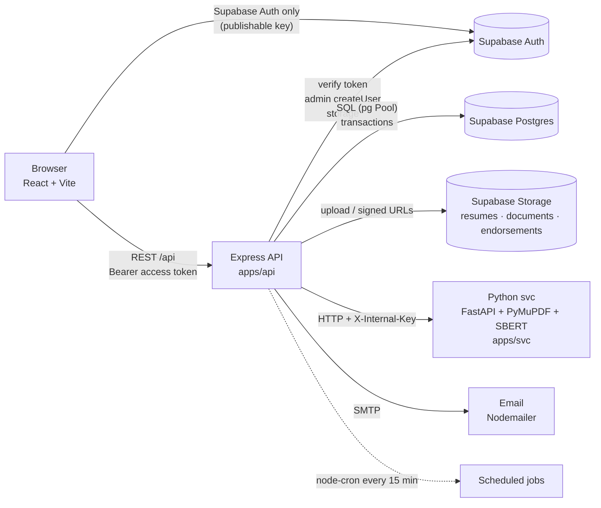

# VERA — Technical Requirements Document (TRD)

> How VERA is built. Product rules: [PRD](./PRD.md). Data: [DATABASE_SCHEMA](./DATABASE_SCHEMA.md). Screens/flows: [APP_FLOW](./APP_FLOW.md). Plan: [ROADMAP](./ROADMAP.md).

---

## 1. Architecture



**Responsibilities**

| Part | Owns | Never does |
|---|---|---|
| `apps/web` | UI, routing, Supabase Auth session (sign-up/in, OTP, Google, reset), calls `/api` | Reads/writes app tables directly, holds secrets |
| `apps/api` | All business rules, authorization, SQL, storage, emails, scheduled jobs, calls svc | Parses PDFs or runs ML |
| `apps/svc` | PDF validation, text extraction, section split, profile extraction, SBERT matching | Talks to the database or is exposed publicly |
| Postgres | Data, constraints, status history trigger, generated scores | Business workflow logic beyond constraints |

---

## 2. Tech stack

| Layer | Choice (current version in repo) | Add |
|---|---|---|
| Monorepo | pnpm workspaces + Turborepo 2 | `packages/shared` |
| Frontend | React 19, Vite 7, React Router 7, Tailwind 4, shadcn/ui (base-ui, `base-vega` style), lucide-react | Roboto (`@fontsource-variable/roboto`, replaces Inter), `@supabase/supabase-js`, `@tanstack/react-query`, `react-hook-form`, `zod`, `@hookform/resolvers`, `sonner`, `date-fns`, `clsx` + `tailwind-merge` (replace the `cn` npm package) |
| Backend | Node (ESM), Express 5, `pg`, `@supabase/supabase-js`, `multer`, `cors`, `dotenv` | `zod`, `helmet`, `express-rate-limit`, `pino` + `pino-http`, `node-cron`, `nodemailer`, `pdfkit`, `exceljs`, `archiver`; dev: `vitest`, `supertest` |
| Microservice | Python 3.11, FastAPI, PyMuPDF (`fitz`), sentence-transformers (`all-MiniLM-L6-v2`), numpy | `requirements.txt`, `uvicorn[standard]`, `python-multipart`, internal-key dependency |
| Database / Auth / Files | Supabase (Postgres 15+, Auth, Storage) | migrations in `supabase/migrations` |

---

## 3. Repository structure

### 3.1 Target layout
```
VERA/
├── CLAUDE.md                     # instructions for Claude Code (read first)
├── CHANGELOG.md
├── CONTRIBUTING.md               # team workflow
├── README.md                     # setup + run (replace the empty one)
├── .claude/                      # Claude Code settings + slash commands (/task, /done, /algo, /migration)
├── .github/pull_request_template.md
├── .vscode/                      # recommended extensions; Todo Tree highlights VERA-ALGO blocks
├── docs/                         # PRD, TRD, DATABASE_SCHEMA, APP_FLOW, ROADMAP, ALGORITHM (+ generated
│                                 # ALGORITHM_INDEX / ALGORITHM_CODE), UI_GUIDELINES, DESIGN, test-cases
├── supabase/
│   ├── migrations/               # 20261006000000_initial_schema.sql, then new files only
│   └── seed.sql
├── scripts/
│   ├── run-py.mjs                # runs the svc venv python on Windows/macOS/Linux
│   └── algo-map.mjs              # VERA-ALGO marker check + index/handout generator
├── packages/
│   └── shared/                   # @vera/shared — enums, labels, constants used by web + api
│       ├── package.json
│       └── src/{index.js,statuses.js,roles.js,documents.js,notifications.js}
├── apps/
│   ├── web/
│   │   └── src/
│   │       ├── main.jsx
│   │       ├── app/              # App.jsx, router.jsx, providers.jsx
│   │       ├── layouts/          # AuthLayout, ApplicantLayout, AdminLayout (sidebar + header + <Outlet/>)
│   │       ├── routes/           # RequireAuth, RequireRole, RequireProfile
│   │       ├── pages/
│   │       │   ├── auth/         # Login, SignUp, VerifyCode, ForgotPassword, ResetPassword, AuthCallback
│   │       │   ├── applicant/    # Setup, Dashboard, Jobs, JobDetail, Documents, Notifications
│   │       │   └── admin/        # Dashboard, Companies, Vacancies, Applicants, Screening, Interviews, Endorsements, TalentPool, Settings, Users, Competencies
│   │       ├── features/         # <feature>/{components/, api.js (react-query hooks), schemas.js}
│   │       ├── components/
│   │       │   ├── ui/           # shadcn-generated ONLY (do not hand-edit beyond theming)
│   │       │   └── shared/       # StatusBadge, PageHeader, EmptyState, ConfirmDialog, FileDropzone, DataTable, ScoreBar
│   │       ├── lib/              # supabase.js, apiClient.js, utils.js (cn), format.js, queryClient.js
│   │       ├── hooks/            # useAuth, useMe, useDebounce
│   │       ├── assets/
│   │       └── index.css         # Tailwind + shadcn tokens (merge global.css and login.css here)
│   ├── api/
│   │   ├── scripts/seed-admin.js
│   │   ├── tests/
│   │   └── src/
│   │       ├── server.js         # import 'dotenv/config'; start http + jobs
│   │       ├── app.js            # helmet, cors, json, pino-http, routes, notFound, errorHandler
│   │       ├── routes.js         # mounts every module router under /api
│   │       ├── config/env.js     # zod-validated process.env (fail fast)
│   │       ├── db/{pool.js,tx.js}
│   │       ├── lib/{supabaseAdmin.js,storage.js,svcClient.js,mailer.js,logger.js,errors.js}
│   │       ├── middleware/{authenticate.js,requireRole.js,validate.js,upload.js,notFound.js,errorHandler.js}
│   │       ├── domain/{statusMachine.js,shortlist.js,prescreen.js,scoring.js,deadlines.js,notify.js}
│   │       ├── modules/          # one folder per feature (see 3.3)
│   │       └── jobs/{index.js, expireDocumentRequests.js, expireInterviewConfirmations.js, ...}
│   └── svc/
│       ├── package.json          # pnpm wrapper: dev/test scripts call ../../scripts/run-py.mjs
│       ├── requirements.txt      # runtime deps (training/requirements.txt stays separate)
│       ├── app/
│       │   ├── main.py           # FastAPI app, lifespan preload, routers
│       │   ├── api/{deps.py,extract.py,match.py}
│       │   ├── core/config.py
│       │   ├── cleaners/ extractors/ standardizers/ validators/   # keep existing modules
│       │   └── matchers/         # chunking, embedding, similarity, coverage, experience, scoring, rules, algorithm (ALGORITHM.md §2)
│       ├── tests/
│       └── training/             # NER training pipeline (not imported by the service)
├── package.json  pnpm-workspace.yaml  turbo.json  .gitignore
```

### 3.2 Cleanup: current → target

| Current | Action |
|---|---|
| `apps/api/.env` was inside the shared zip | **Rotate the Supabase secret key and DB password now.** Keep `.env` out of git and zips; add `.env.example` files |
| `apps/api/pnpm-lock.yaml`, `apps/web/pnpm-lock.yaml` | Delete; keep only the root lockfile; run `pnpm install` at root |
| Root `package.json` has no `dev`/`test` scripts | Add `dev`, `test`, `lint`, `build` (`pnpm -r`; turbo opt-in) |
| svc not started by turbo; no runtime `requirements.txt` | Add `apps/svc/package.json` + `scripts/run-py.mjs` + `requirements.txt` |
| `routes/applicant.router.js`, `routes/user.router.js`, `controllers/test.controllers.js`, `controllers/applicant.controller.js`, `controllers/user.controller.js`, `services/test.service.js`, `services/applicant.service.js`, `services/user.service.js` | **Delete** (mock data; `user.service.js` contains plaintext sample passwords) — **done (S3)** |
| `routes/login/authRoutes.js` + `authController` + `authServices` (`POST /api/auth`) | Replace with Supabase client login in web + `GET /api/me` — API **done (S3)**, web S4 |
| `controllers/applicant/*`, `services/applicant/*`, `routes/applicant/*` | Move into `modules/applicant-profile` and `modules/resumes` — old files **deleted (S3)**; rebuilt in S6 |
| `database/connection.js` (separate `DB_*` vars, unused `Result` import, logs on import) | `db/pool.js` using `DATABASE_URL` + SSL; health check in `/api/health` — **done (S3)** |
| `dotenv.config()` in several files | Load once: `import 'dotenv/config'` in `server.js`, validate in `config/env.js` — **done (S3)** |
| `authMiddleware.js` logs the full user object | Remove PII logs; attach `req.auth = { userId, role, email }` — **done (S3)** |
| `roleMiddleware.js` single role, extra query per route | `requireRole(...roles)` using role loaded once in `authenticate` — **done (S3)** |
| `cors()` open to all | `cors({ origin: env.WEB_ORIGIN, credentials: true })` — **done (S3)** |
| No error handler / validation / rate limit | Add `errorHandler`, `validate(schema)`, `express-rate-limit` on sensitive routes — handler + validate **done (S3)**; rate limit with S6/S11 routes |
| svc URL hard-coded `http://localhost:8000` | `env.SVC_URL` + `X-Internal-Key` |
| multer with no limits | `limits: { fileSize: 10 MB }`, PDF-only `fileFilter` |
| Web: hard-coded `http://localhost:5000` in components | `lib/apiClient.js` with `VITE_API_URL` |
| Web: token in `localStorage` via custom `/api/auth` | `supabase-js` session (remember-me storage adapter, §7.2) |
| Web: each page renders Sidebar + Header itself | Layout routes with `<Outlet/>` |
| Web: mock arrays in `JobVacancies.jsx`, `MyDocuments.jsx`, `DocumentTable.jsx`, `ResumeUpload.jsx` (application) | Replace with react-query hooks to real endpoints |
| Web: two components named `ResumeUpload` | `features/profile/ResumeDropzone.jsx` (setup + replace) and remove the document-selection one (Apply only needs the radio button) |
| Web: file input accepts `.pdf,.doc,.docx` | `.pdf` only until DOCX phase |
| Web: `lib/utils.js` re-exports `cn` from the `cn` package | Standard shadcn `cn` = `twMerge(clsx(...))` |
| Web: `shadcn` in `dependencies` | Move to `devDependencies` (or use `pnpm dlx shadcn`) |
| Web: `styles/global.css`, `styles/login.css` | Merge into `index.css` with Tailwind utilities |
| Folder casing `components/Applicant` vs `components/login` | lowercase folders, PascalCase component files |
| Branches `master`, `frontend-changes`, `backend-changes` | `main` + short-lived `feat/<module>` / `fix/<topic>` branches, merged by PR |

### 3.3 API module pattern
```
modules/vacancies/
  vacancies.routes.js       # router, middleware chain, no logic
  vacancies.controller.js   # parse req → call service → send response
  vacancies.service.js      # business rules, transactions, calls domain/*
  vacancies.repository.js   # SQL only (parameterized), receives a pg client
  vacancies.schemas.js      # zod schemas for body/query/params
```
Modules: `me`, `applicant-profile`, `resumes`, `documents`, `public-vacancies`, `applications`, `companies`, `competencies`, `vacancies`, `screening`, `interviews`, `evaluations`, `endorsements`, `post-hiring`, `talent-pool`, `applicants`, `dashboard`, `notifications`, `settings`, `users`.

---

## 4. Conventions

**General**
- JavaScript ESM everywhere (`"type": "module"`). No TypeScript for now; use JSDoc on domain functions.
- Shared enums/labels come from `@vera/shared` — never hard-code status strings in web or api.
- Files: components `PascalCase.jsx`; everything else `camelCase.js`; folders lowercase-kebab.
- Line endings LF (`.gitattributes`: `* text=auto eol=lf`).
- Matching/scoring code sits inside `VERA-ALGO[ID]` blocks (ALGORITHM.md §3); `pnpm algo:check` must pass.
- UI follows UI_GUIDELINES.md (tokens from DESIGN.md).

**API**
- REST, JSON, base path `/api`. Plural nouns, actions as sub-resources: `POST /api/admin/vacancies/:id/publish`.
- Request/response bodies use **camelCase**; DB stays snake_case; map in repositories.
- Success: `200/201` with `{ data }` (lists: `{ data, meta: { page, pageSize, total } }`).
- Errors: `{ error: { code, message, details? } }` with codes `VALIDATION_ERROR`, `UNAUTHENTICATED`, `FORBIDDEN`, `NOT_FOUND`, `CONFLICT`, `BUSINESS_RULE`, `SVC_UNAVAILABLE`, `INTERNAL`.
- Every status change goes through `domain/statusMachine.transition(client, application, toStatus, reason)` which rejects illegal transitions (APP_FLOW §5.1).
- Every multi-step write runs in `withTransaction(actorId, fn)`; slow svc calls happen **before** opening the transaction.
- Pagination: `?page=1&pageSize=20`; search: `?search=`.

**Web**
- Server state with react-query (`features/<x>/api.js` exports `useVacancies`, `useCreateVacancy`, …). No `fetch` in components.
- Forms: react-hook-form + zod (mirror API schemas).
- UI from shadcn/ui; icons from lucide-react; toasts with sonner.
- Every list has loading, empty, and error states.

**Git**
- Conventional commits referencing PRD IDs: `feat(screening): FR-SCR-03 lock slot on first verification`.
- Update `CHANGELOG.md` under **Unreleased** in the same PR.

---

## 5. Domain logic (apps/api/src/domain)

| File | Function | Rule |
|---|---|---|
| `prescreen.js` | `prescreen(profile, vacancy) → { passed, failedConditions[] }` | DATABASE_SCHEMA §6.1 |
| `scoring.js` | `interviewScore(weights, ratings)`; `finalScore(matching, interview)` | Σ w·r/5 ; (m+i)/2, rounded 2 dp |
| `shortlist.js` | `storedMatchingScore`, `meetsThreshold`, `selectShortlist` (pure), `refreshShortlist(client, vacancyId, applicantType)` | DATABASE_SCHEMA §6.2, locks vacancy row `FOR UPDATE`; moves run with `vera.actor_id` cleared (system) |
| `statusMachine.js` | `transition(...)`, `ALLOWED` map, `assertInitial` | APP_FLOW §5.1; the UPDATE matches the status read (stale → 409) |
| `deadlines.js` | `dueAt(days = setting)` | `response_deadline_days` |
| `notify.js` | `notify(client, { userId, type, applicationId, vars })` | inserts `notification`; sets `email_status='pending'` when the type is emailable (emails deferred in the sprint: always `not_required`) |
| `round.js` | `roundHundredths(value)` | 2 dp half-up on the decimal value |
| `eligibility.js` | `atFailedCompany` / `notAtFailedCompany` (SQL condition), `FAILED_STATUSES`, `BLOCKS_APPLYING_STATUSES` | PRD BR-17, BR-19; DATABASE_SCHEMA §6.6 |

Unit-test these first; they are the thesis-critical logic.

---

## 6. API endpoints

All routes require `Authorization: Bearer <supabase access token>` except `/api/health`.

### 6.1 Common
| Method | Path | Purpose |
|---|---|---|
| GET | `/api/health` | API + DB + svc health |
| GET | `/api/me` | `{ userId, email, role, fullName, accountStatus, hasProfile }` |
| GET | `/api/notifications` | own feed, newest first, `?limit=` (1–50, default 20) → `{ data: [{ notificationId, type, title, message, linkPath, requiresAction, isRead, createdAt }], meta: { unreadCount } }`; every role (S11) |
| POST | `/api/notifications/read-all` | marks the user's unread notifications read → `{ data: { updated } }` (S11; PATCH `/:id/read` not built in the sprint) |

### 6.2 Applicant (`requireRole('applicant')`)
| Method | Path | Purpose (PRD) |
|---|---|---|
| POST | `/api/applicant/resume/parse` | multipart `resume` → svc `/extract` first, then store the draft → `{ profile, warnings, fileName, yearsExperience }` (`profile.email` = account email). 400 not a PDF / > 10 MB / unreadable (svc message), 409 profile already set up (replacement deferred), 503 svc down; 20 req/min per IP (FR-PROF-01..03) |
| POST | `/api/applicant/profile/confirm` | profile fields → file moved `drafts/…` → `<applicantId>/…`, then applicant + resume + resume_extraction in one transaction and the draft deleted → `201 { applicantId }`. 422 no draft, 409 already set up (FR-PROF-04; replacement FR-PROF-06 deferred) |
| GET / PATCH | `/api/applicant/profile` | view / edit profile (FR-PROF-05). PATCH takes the full card (same schema as confirm); email is never changed. 404 before confirm |
| GET | `/api/applicant/resume` · `/api/applicant/resume/url` | current resume `{ resumeId, fileName, fileSizeBytes, uploadedAt, verificationStatus, verificationRemarks }` · `{ url }` signed 10 min (`canReplace` comes with resume replacement, deferred) |
| GET / POST | `/api/applicant/documents` | list current / upload (multipart `file`, `documentType`, `label`, `replacesDocumentId?`); one current per type except certificate/other (FR-DOC-01..04) |
| GET | `/api/applicant/documents/:id/url` | signed URL |
| GET | `/api/applicant/document-requests` | (S12) pending first, then history: `{ requestId, documentType, reason, status, dueAt, requestedAt, fulfilledAt, targetDocumentId, jobTitle }`; never company. Uploading the requested type (`POST /api/applicant/documents`) fulfils it and alerts HR |
| GET | `/api/applicant/vacancies` · `/:id` | open vacancies, agency-branded: list `?search=` (title) → `{ vacancyId, jobTitle, summary, deploymentLocation, employmentType, postedAt }`; detail adds `jobDescription, keyResponsibilities, requiredSkills, experienceRequirement, minYearsExperience, minEducationLevel, minHeightCm`. Never company fields, never age range or gender (RA 10911, UI_GUIDELINES §9); not open → 404. Vacancies of a company where this applicant has a failed application are left out of the list, and their detail is the same 404 "This job is no longer open." (BR-19) |
| POST | `/api/applicant/applications` | `{ vacancyId, applicantType }` → eligibility (BR-17 one ongoing-or-hired application, BR-19 failed company) → prescreen (RANK-01) → svc `/match` with the stored `resume_extraction.sections` and `resolveMatchingWeights(applicantType, vacancy)` (BR-04: skills only when the vacancy has no experience criterion; the weights used are stored in `matching_result.weights`) (before the transaction) → threshold on the rounded score (RANK-02) → one transaction under the applicant and vacancy row locks (eligibility re-checked): application + `matching_result` + notification, shortlist refresh, auto-close when qualified applications reach the cap → `201 { applicationId, status, message, failedConditions? }` (no score, no company). 400 validation · 404 not open · 404 "This job is not available for your application." (failed company; no company, no reason) · 409 "You already have an ongoing application. You can apply to another job once it is finished." (also when the index `application_one_ongoing_per_applicant` catches simultaneous applies) · 409 "You are already hired through Confiable Manpower, so you cannot apply to another job." · 409 no profile / no readable resume ("…Please contact Confiable Manpower so we can update your resume.") / already applied / "Applications for this job just closed." (cap filled or vacancy closed while matching ran) · 503 svc down; 20 req/min per IP (FR-APP-01..09) |
| GET | `/api/applicant/applications` | status panel → `[{ applicationId, vacancyId, jobTitle, applicantType, status, appliedAt, statusChangedAt, actionDueAt, nextDueAt }]` (`nextDueAt` = the earliest of a pending document request's deadline and a pending interview's confirm deadline); never company, `status_reason`, or scores |
| GET | `/api/applicant/interviews` | (S13) own open interviews → `[{ interviewId, applicationId, jobTitle, status, scheduledAt, durationMinutes, confirmDueAt, confirmedAt, interviewerName, meetingLink }]`; `meetingLink` is null until confirmed; never company, scores, or `status_reason` |
| POST | `/api/applicant/interviews/:id/confirm` | (S13) attempt `pending_confirmation` → `confirmed`, application → `interview_confirmed` (applicant = history actor), staff notified (`hr_interview_confirmed`). 404 not their interview; 409 already confirmed, no longer open, or the interview time has passed (the deadline itself is not enforced). Locks job_vacancy → application |
| POST | `/api/applicant/interviews/:id/reschedule-request` | `{ reason }` (FR-INT-03) *(deferred, ROADMAP §6: HR edits the time instead)* |
| POST | `/api/applicant/applications/:id/endorsement/confirm` · `/decline` | (S15, FR-END-04) no body; own application only (404 otherwise); only while `passed_awaiting_confirmation` (409 otherwise; a second confirm → "You already confirmed this endorsement.") → `{ applicationId, status: for_endorsement \| archived }` (never company, scores, or `status_reason`); applicant = history actor; `action_due_at` cleared; staff notified (`hr_endorsement_confirmed` / `_declined`); decline writes no pool entry. The deadline is not enforced. Locks job_vacancy → application |
| GET | `/api/applicant/offers` | (S17, BR-23) the applicant's pending rematch offers → `[{ offerId, jobTitle, deploymentLocation, employmentType, dueAt, offeredAt }]`; never company fields or scores |
| POST | `/api/applicant/offers/:id/accept` · `/decline` | (S17, BR-23) no body. Someone else's or unknown offer → 404; answered → 409. Locks job_vacancy → applicant. **Accept** re-checks (offer pending, pool entry active, vacancy open, endorsement not full, BR-17, BR-19, never applied, prescreen, threshold, final ≥ current passing) → `200 { offerId, status: "accepted", applicationId, applicationStatus: "for_endorsement" }`: application (source `rematch`, `assertInitial(for_endorsement, rematch)`, applicant = actor) + `matching_result` from the offer + `final_evaluation` (ratings source from the offer, `computed_by` null, stored vs JS FIN-01) + offer `accepted` + pool entry closed (`reapplied`) + `hr_rematch_accepted`. A failed re-check → offer `expired` + `rematch_offer_expired` **committed**, then 409 "This job is no longer available. You can apply to other jobs."; no automatic rescan. **Decline** → `200 { offerId, status: "declined" }`, pool availability `available`, `hr_rematch_declined`. 23505 → 409 only for `application_one_ongoing_per_applicant`, `application_applicant_id_job_vacancy_id_key`, `final_evaluation_application_id_key` |

### 6.3 Admin / HR (`requireRole('admin','hr')`; **A** = admin only)
| Method | Path | Purpose |
|---|---|---|
| GET | `/api/admin/dashboard` | counts + upcoming interviews |
| GET / POST | `/api/admin/companies` | list `?search=&page=&pageSize=` (name contains, case-insensitive; ≤ 100 per page) → `{ data: [{ companyId, companyName, industry, contactPersonName, contactEmail, vacancyCount }], meta }` / create (`website` normalized to https://) |
| GET / PATCH | `/api/admin/companies/:id` | detail + `counts: { vacancies, openVacancies, inAgencyInterview, awaitingClient, hired, endorsed }` (PRD FR-COMP-03) / edit. Duplicate name (case-insensitive) → `409 CONFLICT` with `details: [{ path: "companyName" }]` |
| GET | `/api/admin/competencies` | fixed list (active, by `sort_order`) |
| POST / PATCH | `/api/admin/competencies[/:id]` | **A** manage list |
| GET | `/api/admin/vacancies/defaults` | `{ matchingThreshold, capMultiplier }` from `system_setting` (form defaults) |
| GET / POST | `/api/admin/vacancies` | list `?search=` (title or company) `&status=&page=&pageSize=` → cards with `remainingSlots`, `counts { total, screening, interview, passed, hired }` / create draft + competency weights in one transaction (weights total 0 or 100) |
| GET / PATCH | `/api/admin/vacancies/:id` | detail (+ `competencies`, `weightTotal`, `applicationCount`, `editable`) / edit: draft = full form; open/closed/endorsing = posting text + higher cap only (other fields → 422 "Locked after publishing"); filled/archived → 409 |
| POST | `/api/admin/vacancies/:id/{publish,close,reopen,archive}` | status actions under a vacancy row lock (`domain/vacancyStatus.js`); publish needs weights = 100 (422); reopen `{ applicationCap? }` needs applications < cap (422); illegal transition → 409. **Archive** (S15, BR-22): refused (409) while any application is `endorsed`; otherwise closes out the vacancy in the same transaction (`domain/closeOut.js`) and the response adds `closeOut: { notSelected, standby }` counts. Close never closes out |
| GET | `/api/admin/vacancies/:id/ranking` | (S15, FR-END-01, RANK-03) `{ vacancy: { vacancyId, jobTitle, companyName, status, slotsNeeded, endorsementCount, committed, notifyRemaining, canNotify }, ranking: [{ rank, applicationId, applicantName, applicantType, status, appliedAt, actionDueAt, matchingScore, interviewScore, finalScore, passingScore, passed, overallRating, reused }] }`: every evaluated application of the vacancy, any status, both groups; `notifyRemaining` = endorsement count − (passed_awaiting_confirmation + for_endorsement + endorsed); `canNotify` = open, closed, or endorsing. 404 |
| GET | `/api/admin/vacancies/:id/talent-pool-matches` | score active pool entries vs vacancy (FR-VAC-02) |
| POST | `/api/admin/vacancies/:id/notify` | (S15, FR-END-03) `{ applicationIds: uuid[] (1–50, unique), message? (10–1000; default from @vera/shared notifyMessageDefault) }` → `{ notified[], actionDueAt, remaining }`; each → `passed_awaiting_confirmation` (HR = actor, reason "Notified for endorsement") with `action_due_at` = now + `response_deadline_days`; notification `passed_confirm_endorsement`: fixed title "Please confirm: {job}", HR's body + the fixed line "Please confirm on your dashboard by {date} (Philippine time)." 400 validation · 404 vacancy or an application not in it · 409 vacancy not open/closed/endorsing or an application not `passed` · 422 more than the places left or a message naming the company. Locks job_vacancy → applications (ascending id) |
| GET | `/api/admin/applications/:id` | full detail: profile, resume, docs, matching details, ratings, final, history; `reusableEvaluation: { sourceApplicationId, jobTitle, companyName, ratedAt } \| null` (S12, BR-21; chain-safe WSM-03 lookup: the original interview), plus `fullyVerified`, `nextStep: schedule_interview\|reuse_ratings\|null`, documents with `newUpload`; (S14) `evaluation: { interviewScore, finalScore, passed, overallRating, reused } \| null` |
| GET | `/api/admin/screening` | vacancies with shortlisted counts |
| GET | `/api/admin/screening/:vacancyId` | (S12) both groups in one response: `{ vacancy, groups: { experienced, first_time }: { quota, shortlisted[], waitingPool[] }, notShortlisted: { prescreenFailed[], belowThreshold[] } }`; rows carry `locked`, `matchingScore`, `documentsVerified/Total`, `newUploads`, `pendingRequests`, `fullyVerified`, `ratingsOnFile`; HR only (company and scores shown) |
| POST | `/api/admin/screening/:vacancyId/pull-next` | `{ group }` (open decision D1) |
| PATCH | `/api/admin/resumes/:id/verification` · `/api/admin/documents/:id/verification` | (S12) `{ status: verified\|rejected, remarks? (required to reject), applicationId }`; the application must be shortlisted (409) and the file current and the applicant's (422); the first action sets `verification_started_at` |
| GET | `/api/admin/applications/:id/resume/url` · `/documents/:documentId/url` | (S12) signed URL (10 min) of the application's applicant's current file |
| POST | `/api/admin/applications/:id/drop` | (S12) `{ reason: failed_verification\|no_response\|other, remarks? }` → `dropped` (HR actor), pending requests cancelled, applicant notified (no company, no reason), shortlist refreshed → `{ applicationId, status, promoted[] }`; 409 when not shortlisted |
| POST / DELETE | `/api/admin/document-requests[/:id]` | create `{ applicationId, documentType (supporting types only; resume refused during the sprint), targetDocumentId?, reason }` → due = now + `response_deadline_days`, target copy `reupload_requested`, applicant notified (requires action) / cancel a pending request (404 otherwise) |
| GET | `/api/admin/interviewers` | (S13) active HR + admin `[{ userId, fullName, role }]` for the interviewer select |
| GET | `/api/admin/interviews?vacancyId=` | (S13) open attempts (`pending_confirmation` / `confirmed`), both groups, optional vacancy filter → `[{ interviewId, applicationId, status, attemptNumber, scheduledAt, durationMinutes, meetingLink, confirmDueAt, confirmedAt, interviewerId, interviewerName, applicationStatus, applicantType, applicantName, matchingScore, vacancyId, jobTitle, companyName }]` |
| POST | `/api/admin/interviews` | (S13) schedule `{ applicationId, scheduledAt (ISO with offset, future), durationMinutes (15–240, default 30), meetingLink (https), interviewerId (active HR/admin) }` → `201` attempt 1, application → `interview_scheduled` (HR = actor), applicant notified (no link, no company); `confirm_due_at` = min(now + `response_deadline_days`, scheduledAt). 400 validation · 404 · 409 not shortlisted / already has an interview (index `interview_one_open_per_application`) · 422 not fully verified / ratings on file (BR-21) / interviewer not active. Locks job_vacancy → application |
| PATCH | `/api/admin/interviews/:id` | (S13) edit the open attempt in place (same fields minus `applicationId`; `attempt_number` unchanged): a confirmed attempt stays confirmed; an unconfirmed one gets a new confirm deadline; applicant notified (`interview_rescheduled`). 409 once the attempt is no longer open. Locks job_vacancy → application |
| POST | `/api/admin/interviews/:id/no-show` | (S13, FR-INT-05 simplified) through the S12 drop service (`dropApplication` with an interview check under its locks): unconfirmed after the deadline or interview time → attempt `expired`, reason `no_response`; confirmed after the interview time → attempt `no_show`, reason `other` + "No-show"; application `dropped` (HR = actor), applicant notified (neutral), shortlist refilled (system) → `{ interviewId, interviewStatus, applicationId, status, promoted[] }`. 409 too early or no longer open (a confirm that won the lock). Locks job_vacancy → applicant → application |
| POST | `/api/admin/interviews/:id/reschedule` | new attempt after an applicant's reschedule request *(deferred with FR-INT-03, ROADMAP §6)* |
| GET | `/api/admin/applications/:id/evaluation` | (S14) evaluation page → `{ application: { applicationId, status, applicantType, applicantName, matchingScore, passingScore }, vacancy: { vacancyId, jobTitle, companyName }, sections: [{ sectionCode, sectionName, weight, items: [{ competencyId, competencyName }] }], interview: { interviewId, status, scheduledAt, started } \| null, evaluation: { ratings[], sectionScores, interviewScore, overallRating, matchingScore, finalScore, passingScore, passed, computedAt, reused, source: { applicationId, jobTitle, companyName, ratedAt } \| null } \| null, canEvaluate, blockedReason }`; a reused evaluation returns the original interview's ratings (read-only). HR only; 404 |
| POST | `/api/admin/applications/:id/evaluation` | (S14, FR-INT-06) `{ ratings: [{ competencyId, rating 1–5 }] }`, exactly the 15 active items (other body fields ignored; the server recomputes) → `201 { applicationId, status, sectionScores, interviewScore, overallRating, matchingScore, finalScore, passingScore, passed, ratingsSourceApplicationId, reused: false, interviewId, interviewStatus: "completed" }`; stores 15 `competency_rating` rows + `final_evaluation`, attempt → `completed`, `interview_confirmed → passed / did_not_pass` (HR = actor); `did_not_pass` → applicant pool + `evaluation_did_not_pass` notice. 400 validation (missing/duplicate item, rating outside 1–5) · 404 · 409 not `interview_confirmed` / attempt not confirmed / "The interview has not started yet." (`scheduled_at <= now()` in SQL) / already evaluated (incl. 23505 on `final_evaluation_application_id_key` or `competency_rating_application_id_competency_id_key`) · 422 not the 15 active items. Locks job_vacancy → applicant → application |
| POST | `/api/admin/applications/:id/evaluation/reuse` | (S14, FR-INT-08, BR-21) no body: shortlisted + fully verified → the original interview's 15 ratings × this vacancy's section weights (WSM-03) → `201` same shape with `reused: true` and `ratingsSourceApplicationId` = the original interview (chain-safe); no rating rows, no attempt; `shortlisted → passed / did_not_pass`, same pool entry and notice. 404 · 409 not shortlisted / already evaluated · 422 no earlier evaluation, not fully verified, or the source lacks a rating. Locks job_vacancy → applicant → application |
| GET | `/api/admin/endorsements` | (S16) vacancies that reached endorsement (someone for_endorsement, endorsed, or hired, or the vacancy endorsing/filled) → `[{ vacancyId, jobTitle, companyName, status, slotsNeeded, endorsementCount, forEndorsement, endorsed, hired }]` |
| GET | `/api/admin/endorsements/:vacancyId` | (S16) `{ vacancy: { …, hiredCount, passedCount }, candidates: [for_endorsement rows in RANK-03 order with rank and scores], awaitingConfirmation, endorsements: [{ endorsementId, sentAt, items: [{ itemId, applicationId, applicantName, applicantType, status, rank, finalScore, outcome, clientInterviewAt, outcomeRemarks, outcomeRecordedAt, rematchStatus, rematchJobTitle, rematchCompanyName }] }] }` (S17: the latest rematch offer made from the item's pool entry, or nulls). 404 |
| GET | `/api/admin/endorsements/print/:endorsementId` | (S16) printable endorsement (HR document for the client): `{ endorsementId, sentAt, sentBy, vacancy, company: { companyName, contactPersonName, contactEmail }, candidates: [{ rank, fullName, email, contactNumber, age, gender, educationLevel, address, applicantType, matchedSkills, matchingScore, interviewScore, finalScore, overallRating, outcome }] }`. 404 |
| POST | `/api/admin/endorsements` | (S16, FR-END-05/06) `{ vacancyId }` → `201 { endorsementId, sentAt, endorsed[], standby[], vacancyStatus: "endorsing" }`: every `for_endorsement` application → `endorsed` (HR, reason "Endorsed to the client") with an item (RANK-03 rank, stored final, outcome pending); remaining `passed` → `standby` + pool (system, reason "endorsement created: not included"); vacancy → `endorsing`; endorsement status `sent` (no email/PDF/XLSX: printable page). 404 · 409 vacancy draft/filled/archived, a race, or 23505 on `endorsement_item_application_id_key` · 422 nobody for_endorsement. Locks job_vacancy → applicants → applications (ascending) |
| ~~POST~~ | ~~`/api/admin/endorsements/:id/send`~~ · ~~`/:id/files`~~ | *(deferred: no email, PDF, or XLSX during the sprint, ROADMAP §6; the printable page replaces them)* |
| PATCH | `/api/admin/endorsement-items/:id/outcome` | (S16, FR-END-07/09) `{ outcome: hired \| not_hired, clientInterviewAt? (ISO with offset), remarks? (≤ 500) }` → `{ itemId, applicationId, outcome, status, vacancyStatus, closeOut: { notSelected, standby } \| null }`. hired → `hired` (HR); not_hired → `not_hired` (HR) + pool `not_hired`; the hire that makes the vacancy's hired count = `slots_needed` sets the vacancy `filled` and runs `closeOutVacancy(…, "filled")` in the same transaction (endorsed still pending → standby, item remarks "vacancy filled"). 400 · 404 · 409 second decision or the application moved. Locks job_vacancy → this applicant + every close-out applicant (one statement, ascending) → the application. **S17:** after a not_hired commit the automatic rematch runs outside the transaction and the response adds `rematch: { status: "offered", offerId, jobTitle, companyName } \| { status: "no_match" } \| { status: "failed" }` (failed = any error, logged with ids only; the not_hired stays committed). The hired response has no `rematch` field |
| POST | `/api/admin/applications/:id/training-failed` | (S16, FR-END-08, TC-82) hired → `training_failed` (HR, reason "Training failed") + pool `training_failed` + notice `training_failed`. 404 · 409 not hired. Locks job_vacancy → applicant → application |
| ~~PUT~~ | ~~`/api/admin/applications/:id/post-hiring`~~ · ~~`.../post-hiring/send`~~ | *(cut, decided Oct 10: ROADMAP cut #2)* |
| GET | `/api/admin/pool` | (S17, FR-POOL-01 minimal) active pool entries of applicants with no ongoing or hired application → `[{ talentPoolId, poolReason, availability, addedAt, sourceApplicationId, applicantName, sourceJobTitle, sourceCompanyName, offerStatus, offerJobTitle, offerCompanyName, offeredAt }]` (latest offer or nulls). No filters |
| ~~GET~~ | ~~`/api/admin/talent-pool`~~ · ~~POST `/api/admin/talent-pool/:id/invite`~~ · ~~PATCH `/api/admin/talent-pool/:id`~~ | *(replaced by `GET /api/admin/pool` in S17; invitations and availability edits deferred, ROADMAP §6)* |
| POST | `/api/admin/applications/:id/rematch` | (S17, BR-23) **Run rematch again** for a not_hired application, no body. 404 · 409 not not_hired, its pool entry no longer active, applicant not free (BR-17), or an offer already pending (all before any svc call). Scan (prescreen, svc /match per vacancy with no transaction, RANK-02, WSM-01/03, FIN-01, RANK-04) → `200 { status: "offered", offerId, vacancyId, jobTitle, companyName, matchingScore, interviewScore, finalScore, dueAt } \| { status: "no_match" }`; the offer is one transaction under the applicant lock (`pool_invitation` pending, `invited_by` null, `due_at` = now + `response_deadline_days`; availability `invited`; `rematch_offer` + `hr_rematch_offered`). svc down → 503. 23505 → 409 only for `pool_invitation_one_pending`, `pool_invitation_talent_pool_id_job_vacancy_id_key`. Same function as the not_hired hook |
| ~~GET / POST~~ | ~~`/api/admin/rematch…`~~ (suggestions, offer/skip, rescan) | *(replaced in S17 by the automatic offer and Run rematch again, PRD BR-23 sprint note)* |
| GET | `/api/admin/applicants` · `/:id` · `/:id/documents.zip` | management + download |
| GET / PATCH | `/api/admin/settings` | deadlines and defaults |
| GET / POST / PATCH | `/api/admin/users[/:id]` | **A** HR accounts |

---

## 7. Authentication

### 7.1 Supabase project settings
- **Email confirmations ON**; edit the *Confirm signup* template to show the code `{{ .Token }}` (6 digits) instead of a link.
- **Custom SMTP** (Auth → SMTP) — the built-in sender is heavily rate-limited and only for testing.
- **Google provider** ON; authorized redirect: `<WEB_ORIGIN>/auth/callback` (add `http://localhost:5173/auth/callback` for dev).
- Site URL / redirect URLs include `/reset-password` and `/auth/callback`.

### 7.2 Web
```js
// lib/supabase.js — remember-me aware storage
const rememberKey = "vera.remember";
const storage = {
  getItem: (k) => (localStorage.getItem(rememberKey) === "true" ? localStorage : sessionStorage).getItem(k),
  setItem: (k, v) => (localStorage.getItem(rememberKey) === "true" ? localStorage : sessionStorage).setItem(k, v),
  removeItem: (k) => { localStorage.removeItem(k); sessionStorage.removeItem(k); },
};
export const setRememberMe = (on) => localStorage.setItem(rememberKey, String(on));
export const supabase = createClient(import.meta.env.VITE_SUPABASE_URL, import.meta.env.VITE_SUPABASE_PUBLISHABLE_KEY, {
  auth: { storage, persistSession: true, autoRefreshToken: true, detectSessionInUrl: true },
});
```
- Sign-up: `supabase.auth.signUp({ email, password })` → `/signup/verify` → `supabase.auth.verifyOtp({ email, token, type: 'signup' })`.
  *Sprint (S6):* `signUp({ email, password, options: { emailRedirectTo: origin + '/auth/callback', data: { privacy_consent_at } } })` → Supabase's confirmation **link** → `/auth/callback`. The callback handles `#access_token` (implicit, the supabase-js default) and `?code=` (PKCE; `…-code-verifier` keys are always kept in `localStorage` so a link opened in a new tab works). If no session results (another browser/device, expired or used link) it shows "Your email is confirmed. Please log in.". Supabase Auth → URL configuration must allow `<WEB_ORIGIN>/auth/callback`.
- Login: `setRememberMe(checked)` then `signInWithPassword`; Google: `signInWithOAuth({ provider: 'google', options: { redirectTo: origin + '/auth/callback' } })`.
- `apiClient` reads `(await supabase.auth.getSession()).data.session?.access_token` for every request; on `401`, sign out → `/login`.

### 7.3 API
- `authenticate`: `supabaseAdmin.auth.getUser(token)` → load `user_account` (role, status) → reject if missing/inactive → `req.auth = { userId, email, role }`.
- `requireRole(...roles)`.
- `user_account` is created by the DB trigger after email confirmation (role from `app_metadata.vera_role`, default `applicant`).
- HR creation (admin): `supabaseAdmin.auth.admin.createUser({ email, password, email_confirm: true, app_metadata: { vera_role: 'hr' }, user_metadata: { full_name } })`.
- Seed accounts: `pnpm --filter api seed:admin` runs `scripts/seed-admin.js` and creates or updates the admin (`ADMIN_EMAIL` / `ADMIN_PASSWORD` / `ADMIN_FULL_NAME`, `vera_role: 'admin'`) and one HR account (`HR_EMAIL` / `HR_PASSWORD` / `HR_FULL_NAME`, `vera_role: 'hr'`). Idempotent: an existing auth user gets its role and name fixed (password unchanged) and its `user_account` row upserted. Sprint replacement for the User Management UI.
- `authenticate` responses: no/invalid token or no `user_account` → `401 UNAUTHENTICATED`; `account_status = inactive` → `403 FORBIDDEN`.
- Rate limit: 20 req/min per IP on `/api/applicant/resume/parse` and `/api/applicant/applications`.

---

## 8. Microservice contract (`apps/svc`)

All endpoints except `/health` require header `X-Internal-Key: <SVC_INTERNAL_KEY>`. Bind to `127.0.0.1` in production.

### `POST /extract` (multipart `file`)
Validation: PDF, ≤ 10 MB, has extractable meaningful text (existing validators). Response:
```json
{
  "pageCount": 2,
  "rawText": "...",
  "standardizedText": "...",
  "sections": { "header": "...", "experience": "...", "skills": "...", "education": "..." },
  "skillsText": "...",
  "experienceText": "...",
  "yearsExperience": 2.5,
  "profile": {
    "firstName": "", "middleName": "", "lastName": "", "suffix": "",
    "email": "", "contactNumber": "", "birthdate": "YYYY-MM-DD", "gender": "male|female|",
    "heightCm": null, "addressLine": "", "city": "", "province": "",
    "educationLevel": "senior_high|college_graduate|..."
  },
  "warnings": ["no dates found in experience (years counted as 0)"],
  "extractorVersion": "1.0.0"
}
```
`profile` is built by `app/extractors/profile.py` (EXT-04): `addressLine` = house no./street/barangay before the city; `educationLevel` = highest level found (abbreviations and strands only inside the education section; see ALGORITHM.md §4 EXT-04); `heightCm` converted from cm or feet/inches; `birthdate` as `YYYY-MM-DD` (numeric dates read as MM/DD/YYYY); missing values are `""` (`heightCm`: `null`). Unreadable/scanned PDFs return **400** with a readable `detail`.

### `POST /match` (JSON)
```json
{
  "resume": { "sections": { "skills": "...", "experience": "..." } },
  "job": { "skills": "line\nline", "experience": "Title\nduty\nduty", "minYears": 1 },
  "weights": { "skills": 1, "experience": 0 }
}
```
Response: `{ matchScore, scores: { skills, experience }, yearsWorked, matchedSkills[], missingSkills[], skillMatches[], experienceMatches[], warnings[], modelName }` (scores 0–100).
`missingSkills` = required lines whose credit is 0; `matchedSkills` = credit > 0.

### `POST /match/batch` (JSON) — *deferred (P8.4, ROADMAP §6)*
`{ "items": [{ "id": "<applicantId>", "sections": {...} }], "job": {...}, "weights": {...} }` → `[{ "id", "matchScore", ... }]` — used by *Find matches in talent pool*.

Implemented in S5 as `app/api/extract.py` and `app/api/match.py`; the prototype `/process-resume` and `/match-resume` were removed. `/match` applies the same spelling standardization (EXT-02) to the job text that `/extract` applied to the resume, scores are rounded to 2 decimals, and `modelName` comes from `SBERT_MODEL` (default `all-MiniLM-L6-v2`). Validation errors in the JSON body return **422**.

---

## 9. Notifications and email

Emails are queued (`notification.email_status = 'pending'`) inside the business transaction and sent by the `send-pending-emails` job, so a mail outage never rolls back a status change. Templates live in `apps/api/src/lib/emailTemplates/`.

| Type | Recipient | Email | Action |
|---|---|---|---|
| `application_submitted` | applicant | — | — |
| `prescreen_failed` | applicant | — | — |
| `below_threshold` | applicant | — | — |
| `shortlisted` | applicant | — | — |
| `shortlist_displaced` | applicant (moved back to the waiting pool by a higher score) | — | — |
| `document_requested` | applicant | ✓ | ✓ |
| `document_verified` | applicant | — | — |
| `application_dropped` | applicant | ✓ | — |
| `interview_scheduled` / `interview_rescheduled` | applicant | ✓ | ✓ |
| `interview_reminder` | applicant | ✓ | — |
| ~~`applications_terminated`~~ *(removed in S13: confirming an interview does not touch any other application, because an applicant has at most one ongoing application, BR-17)* | — | — | — |
| `not_selected` *(S15, BR-22: "Job closed: {job}" — the job is no longer open, kept in the applicant pool, "You can apply to other jobs."; never "selected")* | applicant | — | — |
| `rematch_offer` *(S17, BR-23: "Another job for you: {job}" — answer on the dashboard by {due} (Philippine time), the employer decides; no company, no score; application_id null)* | applicant | — | ✓ |
| `rematch_offer_expired` *(S17: "Job no longer available: {job}", neutral, ends "You can apply to other jobs."; after a failed accept re-check)* | applicant | — | — |
| `hr_rematch_offered` / `hr_rematch_accepted` / `hr_rematch_declined` *(S17: name the applicant, job, and company)* | all active HR + admin | — | — |
| `evaluation_did_not_pass` *(S14: "Application update: {job}" — not successful this time, kept in the applicant pool, "You can apply to other jobs."; no score, company, or reason; same text after reused ratings)* | applicant | ✓ | — |
| `passed_confirm_endorsement` *(S15: "Please confirm: {job}"; HR's body + fixed deadline line; may say "passed", names the employer's final decision, never the company)* | applicant | ✓ | ✓ |
| `endorsed` *(S16: "Sent to the employer: {job}" — the employer makes the final hiring decision; no company)* | applicant | ✓ | — |
| `moved_to_standby` *(S15/S16: "Kept in our applicant pool: {job}" — will not go forward to the employer, passed the agency assessment, "You can apply to other jobs."; fits archive, fill, and others endorsed)* | applicant | ✓ | — |
| `hired` / `not_hired` *(S16: "Hired: {job}" may sound positive; "Employer decision: {job}" is neutral and ends "You can apply to other jobs."; never the company)* | applicant | ✓ | — |
| `training_failed` *(S16: "Training update: {job}", neutral, ends "You can apply to other jobs.")* | applicant | — | — |
| ~~`post_hiring_details`~~ *(cut with the post-hiring form, Oct 10)* | applicant | — | — |
| `pool_invitation` | applicant | ✓ | ✓ |
| `hr_interview_confirmed` / `hr_reschedule_requested` | all active HR + admin | — | ✓ (reschedule) |
| `hr_document_uploaded` | all active HR + admin | — | — |
| `hr_endorsement_confirmed` / `hr_endorsement_declined` | all active HR + admin | — | — |

Auth emails (sign-up code, password reset) are sent by Supabase Auth, not by this table.

---

## 10. Files and storage

| Bucket | Path | Written by |
|---|---|---|
| `resumes` | `drafts/<userId>/<uuid>.pdf` → moved to `<applicantId>/<uuid>.pdf` on confirm | parse / confirm |
| `documents` | `<applicantId>/<uuid>.pdf` | document upload |
| `endorsements` | `<endorsementId>/form.pdf`, `<endorsementId>/summary.xlsx` | endorsement generation |

- Buckets are private; the API returns signed URLs valid for 10 minutes after checking ownership/role.
- Uploads: multer memory storage, 10 MB, `application/pdf` + `%PDF` magic-byte check.
- Never trust client file names for paths; always generate UUID names.

---

## 11. Testing

| Level | Tool | Scope |
|---|---|---|
| Unit | `vitest` (api) | `domain/*`: prescreen, scoring, statusMachine, shortlist ordering |
| Unit | `pytest` (svc) | existing tests + `/extract` profile fields + `/match` weights |
| Integration | `supertest` + test Supabase project (or local `supabase start`) | each module's happy path + permission checks |
| Component | `vitest` + Testing Library (web) | forms (sign-up, vacancy form, evaluation form) |
| System (black-box) | manual test cases table `docs/test-cases.md` (TC-xx ↔ FR-xx) | thesis Table 2 |
| Algorithm evaluation | svc `training/` scripts | extraction P/R/F1; Spearman ρ vs HR ranking |

| Algorithm traceability | `pnpm algo:check` | every implemented step has a `VERA-ALGO` block; registry and code agree |

Run all: `pnpm test` (`pnpm -r` runs `test` in each app) and `pnpm algo:check`.

---

## 12. Environment variables

`apps/api/.env.example`
```
NODE_ENV=development
PORT=5000
WEB_ORIGIN=http://localhost:5173
DATABASE_URL=postgresql://postgres.<project-ref>:<password>@<pooler-host>:5432/postgres
DATABASE_SSL=true
SUPABASE_URL=https://<project-ref>.supabase.co
SUPABASE_SECRET_KEY=<secret / service_role key — server only>
SVC_URL=http://127.0.0.1:8000
SVC_INTERNAL_KEY=<random 32+ chars, same as svc>
SMTP_HOST=smtp.gmail.com
SMTP_PORT=465
SMTP_USER=
SMTP_PASS=<gmail app password>
MAIL_FROM="Confiable Manpower (VERA) <your-address@gmail.com>"
JOBS_ENABLED=true
ADMIN_EMAIL=
ADMIN_PASSWORD=
ADMIN_FULL_NAME=VERA Admin
HR_EMAIL=
HR_PASSWORD=
HR_FULL_NAME=VERA HR
```

`apps/web/.env.example`
```
VITE_API_URL=http://localhost:5000/api
VITE_SUPABASE_URL=https://<project-ref>.supabase.co
VITE_SUPABASE_PUBLISHABLE_KEY=<publishable / anon key — safe in the browser>
```

`apps/svc/.env.example`
```
SVC_INTERNAL_KEY=<same as api>
SBERT_MODEL=all-MiniLM-L6-v2
```

---

## 13. Local development

```bash
# once
pnpm install                                   # root
cd apps/svc && python -m venv .venv
.venv\Scripts\pip install -r requirements.txt  # Windows  (macOS/Linux: .venv/bin/pip ...)
cd ../..
# every day
pnpm dev                                       # pnpm -r --parallel runs web (5173), api (5000), svc (8000)
```

`scripts/run-py.mjs`
```js
import { spawn } from "node:child_process";
import { existsSync } from "node:fs";
import path from "node:path";

const venv = path.resolve(process.cwd(), ".venv");
const python = process.platform === "win32"
  ? path.join(venv, "Scripts", "python.exe")
  : path.join(venv, "bin", "python");

if (!existsSync(python)) {
  console.error(`[svc] venv not found at ${python}. Create it and install requirements.txt first.`);
  process.exit(1);
}
const child = spawn(python, process.argv.slice(2), { stdio: "inherit" });
child.on("exit", (code) => process.exit(code ?? 0));
```

`apps/svc/package.json`
```json
{
  "name": "svc",
  "private": true,
  "scripts": {
    "dev": "node ../../scripts/run-py.mjs -m uvicorn app.main:app --reload --host 127.0.0.1 --port 8000",
    "test": "node ../../scripts/run-py.mjs -m pytest"
  }
}
```

Root `package.json` scripts
```json
{
  "dev": "pnpm -r --parallel --if-present run dev",
  "dev:turbo": "turbo run dev",
  "build": "pnpm -r --if-present run build",
  "lint": "pnpm -r --if-present run lint",
  "test": "pnpm -r --if-present run test",
  "test:turbo": "turbo run test",
  "algo:check": "node scripts/algo-map.mjs --check",
  "algo:map": "node scripts/algo-map.mjs",
  "algo:snippets": "node scripts/algo-map.mjs --snippets"
}
```

`turbo.json` tasks: `dev` (`cache: false`, `persistent: true`), `build` (`dependsOn: ["^build"]`, `outputs: ["dist/**"]`), `lint`, `test` (`dependsOn: ["^build"]`).

Root scripts use `pnpm -r` because Windows Smart App Control blocks the unsigned `turbo.exe`; `dev:turbo` / `test:turbo` remain for machines where turbo is allowed.

---

## 14. Security checklist

- [ ] Secrets rotated after the zip was shared; `.env` never committed or zipped.
- [ ] Browser only has the publishable key; RLS enabled on all tables with no public policies.
- [ ] Every admin route has `requireRole('admin','hr')`; user/competency management `requireRole('admin')`.
- [ ] Applicants can only access their own rows (service layer always filters by `req.auth.userId`).
- [ ] Applicant vacancy endpoints never return company fields.
- [ ] Parameterized SQL only (no string concatenation).
- [ ] File type + size validated in api **and** svc; private buckets; short signed URLs.
- [x] svc requires `X-Internal-Key` and listens on 127.0.0.1.
- [ ] No PII (names, emails, resume text) in logs.
- [ ] Rate limits on parse/apply; helmet headers; CORS restricted.
- [x] Data Privacy Act consent stored at sign-up (`user_metadata.privacy_consent_at`).
