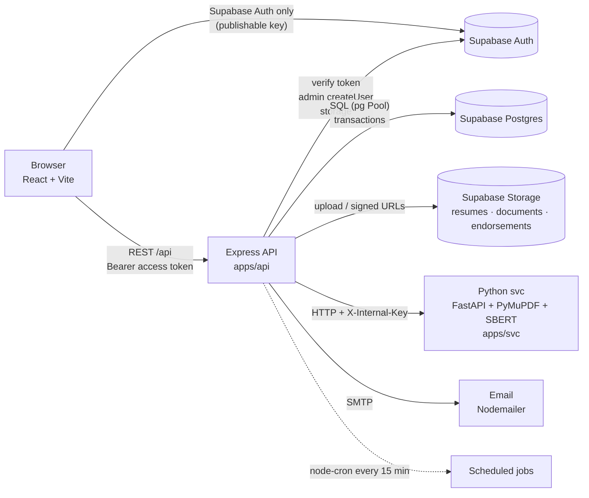

# VERA — Technical Requirements Document (TRD)

> How VERA is built. Product rules: [PRD](./PRD.md). Data: [DATABASE_SCHEMA](./DATABASE_SCHEMA.md). Screens/flows: [APP_FLOW](./APP_FLOW.md). Plan: [ROADMAP](./ROADMAP.md).

---

## 1. Architecture



**Responsibilities**

| Part | Owns | Never does |
|---|---|---|
| `apps/web` | UI, routing, Supabase Auth session (sign-up/in, OTP, Google, reset), calls `/api` | Reads/writes app tables directly, holds secrets |
| `apps/api` | All business rules, authorization, SQL, storage, emails, scheduled jobs, calls svc | Parses PDFs or runs ML |
| `apps/svc` | PDF validation, text extraction, section split, profile extraction, SBERT matching | Talks to the database or is exposed publicly |
| Postgres | Data, constraints, status history trigger, generated scores | Business workflow logic beyond constraints |

---

## 2. Tech stack

| Layer | Choice (current version in repo) | Add |
|---|---|---|
| Monorepo | pnpm workspaces + Turborepo 2 | `packages/shared` |
| Frontend | React 19, Vite 7, React Router 7, Tailwind 4, shadcn/ui (base-ui, `base-vega` style), lucide-react | Roboto (`@fontsource-variable/roboto`, replaces Inter), `@supabase/supabase-js`, `@tanstack/react-query`, `react-hook-form`, `zod`, `@hookform/resolvers`, `sonner`, `date-fns`, `clsx` + `tailwind-merge` (replace the `cn` npm package) |
| Backend | Node (ESM), Express 5, `pg`, `@supabase/supabase-js`, `multer`, `cors`, `dotenv` | `zod`, `helmet`, `express-rate-limit`, `pino` + `pino-http`, `node-cron`, `nodemailer`, `pdfkit`, `exceljs`, `archiver`; dev: `vitest`, `supertest` |
| Microservice | Python 3.11, FastAPI, PyMuPDF (`fitz`), sentence-transformers (`all-MiniLM-L6-v2`), numpy | `requirements.txt`, `uvicorn[standard]`, `python-multipart`, internal-key dependency |
| Database / Auth / Files | Supabase (Postgres 15+, Auth, Storage) | migrations in `supabase/migrations` |

---

## 3. Repository structure

### 3.1 Target layout
```
VERA/
├── CLAUDE.md                     # instructions for Claude Code (read first)
├── CHANGELOG.md
├── CONTRIBUTING.md               # team workflow
├── README.md                     # setup + run (replace the empty one)
├── .claude/                      # Claude Code settings + slash commands (/task, /done, /algo, /migration)
├── .github/pull_request_template.md
├── .vscode/                      # recommended extensions; Todo Tree highlights VERA-ALGO blocks
├── docs/                         # PRD, TRD, DATABASE_SCHEMA, APP_FLOW, ROADMAP, ALGORITHM (+ generated
│                                 # ALGORITHM_INDEX / ALGORITHM_CODE), UI_GUIDELINES, DESIGN, test-cases
├── supabase/
│   ├── migrations/               # 20261006000000_initial_schema.sql, then new files only
│   └── seed.sql
├── scripts/
│   ├── run-py.mjs                # runs the svc venv python on Windows/macOS/Linux
│   └── algo-map.mjs              # VERA-ALGO marker check + index/handout generator
├── packages/
│   └── shared/                   # @vera/shared — enums, labels, constants used by web + api
│       ├── package.json
│       └── src/{index.js,statuses.js,roles.js,documents.js,notifications.js}
├── apps/
│   ├── web/
│   │   └── src/
│   │       ├── main.jsx
│   │       ├── app/              # App.jsx, router.jsx, providers.jsx
│   │       ├── layouts/          # AuthLayout, ApplicantLayout, AdminLayout (sidebar + header + <Outlet/>)
│   │       ├── routes/           # RequireAuth, RequireRole, RequireProfile
│   │       ├── pages/
│   │       │   ├── auth/         # Login, SignUp, VerifyCode, ForgotPassword, ResetPassword, AuthCallback
│   │       │   ├── applicant/    # Setup, Dashboard, Jobs, JobDetail, Documents, Notifications
│   │       │   └── admin/        # Dashboard, Companies, Vacancies, Applicants, Screening, Interviews, Endorsements, TalentPool, Settings, Users, Competencies
│   │       ├── features/         # <feature>/{components/, api.js (react-query hooks), schemas.js}
│   │       ├── components/
│   │       │   ├── ui/           # shadcn-generated ONLY (do not hand-edit beyond theming)
│   │       │   └── shared/       # StatusBadge, PageHeader, EmptyState, ConfirmDialog, FileDropzone, DataTable, ScoreBar
│   │       ├── lib/              # supabase.js, apiClient.js, utils.js (cn), format.js, queryClient.js
│   │       ├── hooks/            # useAuth, useMe, useDebounce
│   │       ├── assets/
│   │       └── index.css         # Tailwind + shadcn tokens (merge global.css and login.css here)
│   ├── api/
│   │   ├── scripts/seed-admin.js
│   │   ├── tests/
│   │   └── src/
│   │       ├── server.js         # import 'dotenv/config'; start http + jobs
│   │       ├── app.js            # helmet, cors, json, pino-http, routes, notFound, errorHandler
│   │       ├── routes.js         # mounts every module router under /api
│   │       ├── config/env.js     # zod-validated process.env (fail fast)
│   │       ├── db/{pool.js,tx.js}
│   │       ├── lib/{supabaseAdmin.js,storage.js,svcClient.js,mailer.js,logger.js,errors.js}
│   │       ├── middleware/{authenticate.js,requireRole.js,validate.js,upload.js,notFound.js,errorHandler.js}
│   │       ├── domain/{statusMachine.js,shortlist.js,prescreen.js,scoring.js,deadlines.js,notify.js}
│   │       ├── modules/          # one folder per feature (see 3.3)
│   │       └── jobs/{index.js, expireDocumentRequests.js, expireInterviewConfirmations.js, ...}
│   └── svc/
│       ├── package.json          # turbo wrapper: dev/test scripts call ../../scripts/run-py.mjs
│       ├── requirements.txt      # runtime deps (training/requirements.txt stays separate)
│       ├── app/
│       │   ├── main.py           # FastAPI app, lifespan preload, routers
│       │   ├── api/{deps.py,extract.py,match.py}
│       │   ├── core/config.py
│       │   ├── cleaners/ extractors/ standardizers/ validators/   # keep existing modules
│       │   └── matchers/         # chunking, embedding, similarity, coverage, experience, scoring, rules, algorithm (ALGORITHM.md §2)
│       ├── tests/
│       └── training/             # NER training pipeline (not imported by the service)
├── package.json  pnpm-workspace.yaml  turbo.json  .gitignore
```

### 3.2 Cleanup: current → target

| Current | Action |
|---|---|
| `apps/api/.env` was inside the shared zip | **Rotate the Supabase secret key and DB password now.** Keep `.env` out of git and zips; add `.env.example` files |
| `apps/api/pnpm-lock.yaml`, `apps/web/pnpm-lock.yaml` | Delete; keep only the root lockfile; run `pnpm install` at root |
| Root `package.json` has no `dev`/`test` scripts | Add `dev`, `test`, `lint`, `build` (turbo) |
| svc not started by turbo; no runtime `requirements.txt` | Add `apps/svc/package.json` + `scripts/run-py.mjs` + `requirements.txt` |
| `routes/applicant.router.js`, `routes/user.router.js`, `controllers/test.controllers.js`, `controllers/applicant.controller.js`, `controllers/user.controller.js`, `services/test.service.js`, `services/applicant.service.js`, `services/user.service.js` | **Delete** (mock data; `user.service.js` contains plaintext sample passwords) |
| `routes/login/authRoutes.js` + `authController` + `authServices` (`POST /api/auth`) | Replace with Supabase client login in web + `GET /api/me` |
| `controllers/applicant/*`, `services/applicant/*`, `routes/applicant/*` | Move into `modules/applicant-profile` and `modules/resumes` |
| `database/connection.js` (separate `DB_*` vars, unused `Result` import, logs on import) | `db/pool.js` using `DATABASE_URL` + SSL; health check in `/api/health` |
| `dotenv.config()` in several files | Load once: `import 'dotenv/config'` in `server.js`, validate in `config/env.js` |
| `authMiddleware.js` logs the full user object | Remove PII logs; attach `req.auth = { userId, role, email }` |
| `roleMiddleware.js` single role, extra query per route | `requireRole(...roles)` using role loaded once in `authenticate` |
| `cors()` open to all | `cors({ origin: env.WEB_ORIGIN, credentials: true })` |
| No error handler / validation / rate limit | Add `errorHandler`, `validate(schema)`, `express-rate-limit` on sensitive routes |
| svc URL hard-coded `http://localhost:8000` | `env.SVC_URL` + `X-Internal-Key` |
| multer with no limits | `limits: { fileSize: 10 MB }`, PDF-only `fileFilter` |
| Web: hard-coded `http://localhost:5000` in components | `lib/apiClient.js` with `VITE_API_URL` |
| Web: token in `localStorage` via custom `/api/auth` | `supabase-js` session (remember-me storage adapter, §7.2) |
| Web: each page renders Sidebar + Header itself | Layout routes with `<Outlet/>` |
| Web: mock arrays in `JobVacancies.jsx`, `MyDocuments.jsx`, `DocumentTable.jsx`, `ResumeUpload.jsx` (application) | Replace with react-query hooks to real endpoints |
| Web: two components named `ResumeUpload` | `features/profile/ResumeDropzone.jsx` (setup + replace) and remove the document-selection one (Apply only needs the radio button) |
| Web: file input accepts `.pdf,.doc,.docx` | `.pdf` only until DOCX phase |
| Web: `lib/utils.js` re-exports `cn` from the `cn` package | Standard shadcn `cn` = `twMerge(clsx(...))` |
| Web: `shadcn` in `dependencies` | Move to `devDependencies` (or use `pnpm dlx shadcn`) |
| Web: `styles/global.css`, `styles/login.css` | Merge into `index.css` with Tailwind utilities |
| Folder casing `components/Applicant` vs `components/login` | lowercase folders, PascalCase component files |
| Branches `master`, `frontend-changes`, `backend-changes` | `main` + short-lived `feat/<module>` / `fix/<topic>` branches, merged by PR |

### 3.3 API module pattern
```
modules/vacancies/
  vacancies.routes.js       # router, middleware chain, no logic
  vacancies.controller.js   # parse req → call service → send response
  vacancies.service.js      # business rules, transactions, calls domain/*
  vacancies.repository.js   # SQL only (parameterized), receives a pg client
  vacancies.schemas.js      # zod schemas for body/query/params
```
Modules: `me`, `applicant-profile`, `resumes`, `documents`, `public-vacancies`, `applications`, `companies`, `competencies`, `vacancies`, `screening`, `interviews`, `evaluations`, `endorsements`, `post-hiring`, `talent-pool`, `applicants`, `dashboard`, `notifications`, `settings`, `users`.

---

## 4. Conventions

**General**
- JavaScript ESM everywhere (`"type": "module"`). No TypeScript for now; use JSDoc on domain functions.
- Shared enums/labels come from `@vera/shared` — never hard-code status strings in web or api.
- Files: components `PascalCase.jsx`; everything else `camelCase.js`; folders lowercase-kebab.
- Line endings LF (`.gitattributes`: `* text=auto eol=lf`).
- Matching/scoring code sits inside `VERA-ALGO[ID]` blocks (ALGORITHM.md §3); `pnpm algo:check` must pass.
- UI follows UI_GUIDELINES.md (tokens from DESIGN.md).

**API**
- REST, JSON, base path `/api`. Plural nouns, actions as sub-resources: `POST /api/admin/vacancies/:id/publish`.
- Request/response bodies use **camelCase**; DB stays snake_case; map in repositories.
- Success: `200/201` with `{ data }` (lists: `{ data, meta: { page, pageSize, total } }`).
- Errors: `{ error: { code, message, details? } }` with codes `VALIDATION_ERROR`, `UNAUTHENTICATED`, `FORBIDDEN`, `NOT_FOUND`, `CONFLICT`, `BUSINESS_RULE`, `SVC_UNAVAILABLE`, `INTERNAL`.
- Every status change goes through `domain/statusMachine.transition(client, application, toStatus, reason)` which rejects illegal transitions (APP_FLOW §5.1).
- Every multi-step write runs in `withTransaction(actorId, fn)`; slow svc calls happen **before** opening the transaction.
- Pagination: `?page=1&pageSize=20`; search: `?search=`.

**Web**
- Server state with react-query (`features/<x>/api.js` exports `useVacancies`, `useCreateVacancy`, …). No `fetch` in components.
- Forms: react-hook-form + zod (mirror API schemas).
- UI from shadcn/ui; icons from lucide-react; toasts with sonner.
- Every list has loading, empty, and error states.

**Git**
- Conventional commits referencing PRD IDs: `feat(screening): FR-SCR-03 lock slot on first verification`.
- Update `CHANGELOG.md` under **Unreleased** in the same PR.

---

## 5. Domain logic (apps/api/src/domain)

| File | Function | Rule |
|---|---|---|
| `prescreen.js` | `prescreen(profile, vacancy) → { passed, failedConditions[] }` | DATABASE_SCHEMA §6.1 |
| `scoring.js` | `interviewScore(weights, ratings)`; `finalScore(matching, interview)` | Σ w·r/5 ; (m+i)/2, rounded 2 dp |
| `shortlist.js` | `refreshShortlist(client, vacancyId, applicantType)` | DATABASE_SCHEMA §6.2, locks vacancy row `FOR UPDATE` |
| `statusMachine.js` | `transition(...)`, `ALLOWED` map | APP_FLOW §5.1 |
| `deadlines.js` | `dueAt(days = setting)` | `response_deadline_days` |
| `notify.js` | `notify(client, { userId, type, applicationId, vars })` | inserts `notification`; sets `email_status='pending'` when the type is emailable |

Unit-test these first; they are the thesis-critical logic.

---

## 6. API endpoints

All routes require `Authorization: Bearer <supabase access token>` except `/api/health`.

### 6.1 Common
| Method | Path | Purpose |
|---|---|---|
| GET | `/api/health` | API + DB + svc health |
| GET | `/api/me` | `{ userId, email, role, accountStatus, hasProfile }` |
| GET | `/api/notifications` | feed (paginated) + `unreadCount` |
| PATCH | `/api/notifications/:id/read` · POST `/api/notifications/read-all` | mark read |

### 6.2 Applicant (`requireRole('applicant')`)
| Method | Path | Purpose (PRD) |
|---|---|---|
| POST | `/api/applicant/resume/parse` | multipart `resume` → store draft, call svc `/extract`, return prefilled profile (FR-PROF-01..03, 06) |
| POST | `/api/applicant/profile/confirm` | confirm profile + draft → create applicant/resume/extraction, or replace resume (FR-PROF-04, 06) |
| GET / PATCH | `/api/applicant/profile` | view / edit profile (FR-PROF-05) |
| GET | `/api/applicant/resume` | current resume + signed URL + `canReplace` + reason |
| GET / POST | `/api/applicant/documents` | list / upload (multipart `file`, `documentType`, `label`) (FR-DOC-01..04) |
| GET | `/api/applicant/documents/:id/url` | signed URL |
| GET | `/api/applicant/document-requests` | pending + history |
| GET | `/api/applicant/vacancies` · `/:id` | open vacancies, agency-branded (no company fields) |
| POST | `/api/applicant/applications` | `{ vacancyId, applicantType }` → prescreen → match → status (FR-APP-*) |
| GET | `/api/applicant/applications` | status panel |
| GET | `/api/applicant/interviews` | pending/upcoming |
| POST | `/api/applicant/interviews/:id/confirm` · `/reschedule-request` | `{ reason }` for reschedule (FR-INT-03) |
| POST | `/api/applicant/applications/:id/endorsement/confirm` · `/decline` | (FR-END-04) |

### 6.3 Admin / HR (`requireRole('admin','hr')`; **A** = admin only)
| Method | Path | Purpose |
|---|---|---|
| GET | `/api/admin/dashboard` | counts + upcoming interviews |
| GET / POST | `/api/admin/companies` | list (search) / create |
| GET / PATCH | `/api/admin/companies/:id` | detail with stats / edit |
| GET | `/api/admin/competencies` | fixed list |
| POST / PATCH | `/api/admin/competencies[/:id]` | **A** manage list |
| GET / POST | `/api/admin/vacancies` | list / create draft (with competencies + weights) |
| GET / PATCH | `/api/admin/vacancies/:id` | detail / edit |
| POST | `/api/admin/vacancies/:id/{publish,close,reopen,archive}` | status actions |
| GET | `/api/admin/vacancies/:id/ranking` | final ranking (combined) |
| GET | `/api/admin/vacancies/:id/talent-pool-matches` | score active pool entries vs vacancy (FR-VAC-02) |
| POST | `/api/admin/vacancies/:id/notify` | `{ applicationIds[], message }` (FR-END-03) |
| GET | `/api/admin/applications/:id` | full detail: profile, resume, docs, matching details, ratings, final, history |
| GET | `/api/admin/screening` | vacancies with shortlisted counts |
| GET | `/api/admin/screening/:vacancyId?group=first_time\|experienced` | shortlist for a group |
| POST | `/api/admin/screening/:vacancyId/pull-next` | `{ group }` (open decision D1) |
| PATCH | `/api/admin/resumes/:id/verification` · `/api/admin/documents/:id/verification` | `{ status, remarks }` |
| POST / DELETE | `/api/admin/document-requests[/:id]` | create `{ applicationId, documentType, targetDocumentId?, reason }` / cancel |
| GET | `/api/admin/interviews?vacancyId=` | combined list |
| POST | `/api/admin/interviews` | schedule `{ applicationId, scheduledAt, durationMinutes, meetingLink, interviewerId }` |
| POST | `/api/admin/interviews/:id/{reschedule,no-show}` | reschedule `{ scheduledAt, ... }` |
| POST | `/api/admin/applications/:id/evaluation` | `{ ratings: [{ competencyId, rating }] }` → final evaluation |
| GET | `/api/admin/endorsements` · `/:vacancyId` | vacancies with for-endorsement counts / list |
| POST | `/api/admin/endorsements` | `{ vacancyId }` → create draft + generate PDF/XLSX |
| POST | `/api/admin/endorsements/:id/send` | `{ toEmail, message }` |
| GET | `/api/admin/endorsements/:id/files` | signed URLs |
| PATCH | `/api/admin/endorsement-items/:id/outcome` | `{ outcome, clientInterviewAt?, remarks? }` |
| PUT | `/api/admin/applications/:id/post-hiring` · POST `.../post-hiring/send` · POST `.../training-failed` | post-hiring (FR-END-08) |
| GET | `/api/admin/talent-pool` | filters |
| POST | `/api/admin/talent-pool/:id/invite` · PATCH `/api/admin/talent-pool/:id` | `{ vacancyId }` / `{ availability }` |
| GET | `/api/admin/applicants` · `/:id` · `/:id/documents.zip` | management + download |
| GET / PATCH | `/api/admin/settings` | deadlines and defaults |
| GET / POST / PATCH | `/api/admin/users[/:id]` | **A** HR accounts |

---

## 7. Authentication

### 7.1 Supabase project settings
- **Email confirmations ON**; edit the *Confirm signup* template to show the code `{{ .Token }}` (6 digits) instead of a link.
- **Custom SMTP** (Auth → SMTP) — the built-in sender is heavily rate-limited and only for testing.
- **Google provider** ON; authorized redirect: `<WEB_ORIGIN>/auth/callback` (add `http://localhost:5173/auth/callback` for dev).
- Site URL / redirect URLs include `/reset-password` and `/auth/callback`.

### 7.2 Web
```js
// lib/supabase.js — remember-me aware storage
const rememberKey = "vera.remember";
const storage = {
  getItem: (k) => (localStorage.getItem(rememberKey) === "true" ? localStorage : sessionStorage).getItem(k),
  setItem: (k, v) => (localStorage.getItem(rememberKey) === "true" ? localStorage : sessionStorage).setItem(k, v),
  removeItem: (k) => { localStorage.removeItem(k); sessionStorage.removeItem(k); },
};
export const setRememberMe = (on) => localStorage.setItem(rememberKey, String(on));
export const supabase = createClient(import.meta.env.VITE_SUPABASE_URL, import.meta.env.VITE_SUPABASE_PUBLISHABLE_KEY, {
  auth: { storage, persistSession: true, autoRefreshToken: true, detectSessionInUrl: true },
});
```
- Sign-up: `supabase.auth.signUp({ email, password })` → `/signup/verify` → `supabase.auth.verifyOtp({ email, token, type: 'signup' })`.
- Login: `setRememberMe(checked)` then `signInWithPassword`; Google: `signInWithOAuth({ provider: 'google', options: { redirectTo: origin + '/auth/callback' } })`.
- `apiClient` reads `(await supabase.auth.getSession()).data.session?.access_token` for every request; on `401`, sign out → `/login`.

### 7.3 API
- `authenticate`: `supabaseAdmin.auth.getUser(token)` → load `user_account` (role, status) → reject if missing/inactive → `req.auth = { userId, email, role }`.
- `requireRole(...roles)`.
- `user_account` is created by the DB trigger after email confirmation (role from `app_metadata.vera_role`, default `applicant`).
- HR creation (admin): `supabaseAdmin.auth.admin.createUser({ email, password, email_confirm: true, app_metadata: { vera_role: 'hr' }, user_metadata: { full_name } })`.
- Seed admin: `pnpm --filter api seed:admin` runs `scripts/seed-admin.js` with `ADMIN_EMAIL` / `ADMIN_PASSWORD` and `vera_role: 'admin'` (idempotent).
- Rate limit: 20 req/min per IP on `/api/applicant/resume/parse` and `/api/applicant/applications`.

---

## 8. Microservice contract (`apps/svc`)

All endpoints except `/health` require header `X-Internal-Key: <SVC_INTERNAL_KEY>`. Bind to `127.0.0.1` in production.

### `POST /extract` (multipart `file`)
Validation: PDF, ≤ 10 MB, has extractable meaningful text (existing validators). Response:
```json
{
  "pageCount": 2,
  "rawText": "...",
  "standardizedText": "...",
  "sections": { "header": "...", "experience": "...", "skills": "...", "education": "..." },
  "skillsText": "...",
  "experienceText": "...",
  "yearsExperience": 2.5,
  "profile": {
    "firstName": "", "middleName": "", "lastName": "", "suffix": "",
    "email": "", "contactNumber": "", "birthdate": "YYYY-MM-DD", "gender": "male|female|",
    "heightCm": null, "addressLine": "", "city": "", "province": "",
    "educationLevel": "senior_high|college_graduate|..."
  },
  "warnings": ["no dates found in experience (years counted as 0)"],
  "extractorVersion": "1.0.0"
}
```
Gaps to build: `addressLine` and `educationLevel` extraction (map degree keywords in the education section to the enum), height → cm.

### `POST /match` (JSON)
```json
{
  "resume": { "sections": { "skills": "...", "experience": "..." } },
  "job": { "skills": "line\nline", "experience": "Title\nduty\nduty", "minYears": 1 },
  "weights": { "skills": 1, "experience": 0 }
}
```
Response: `{ matchScore, scores: { skills, experience }, yearsWorked, matchedSkills[], missingSkills[], skillMatches[], experienceMatches[], warnings[], modelName }` (scores 0–100).
`missingSkills` = required lines whose credit is 0; `matchedSkills` = credit > 0.

### `POST /match/batch` (JSON)
`{ "items": [{ "id": "<applicantId>", "sections": {...} }], "job": {...}, "weights": {...} }` → `[{ "id", "matchScore", ... }]` — used by *Find matches in talent pool*.

Keep `/process-resume` and `/match-resume` only until the new endpoints pass tests, then delete.

---

## 9. Notifications and email

Emails are queued (`notification.email_status = 'pending'`) inside the business transaction and sent by the `send-pending-emails` job, so a mail outage never rolls back a status change. Templates live in `apps/api/src/lib/emailTemplates/`.

| Type | Recipient | Email | Action |
|---|---|---|---|
| `application_submitted` | applicant | — | — |
| `prescreen_failed` | applicant | — | — |
| `below_threshold` | applicant | — | — |
| `shortlisted` | applicant | — | — |
| `document_requested` | applicant | ✓ | ✓ |
| `document_verified` | applicant | — | — |
| `application_dropped` | applicant | ✓ | — |
| `interview_scheduled` / `interview_rescheduled` | applicant | ✓ | ✓ |
| `interview_reminder` | applicant | ✓ | — |
| `applications_terminated` | applicant | — | — |
| `evaluation_did_not_pass` | applicant | ✓ | — |
| `passed_confirm_endorsement` | applicant | ✓ | ✓ |
| `endorsed` | applicant | ✓ | — |
| `moved_to_standby` | applicant | ✓ | — |
| `hired` / `not_hired` | applicant | ✓ | — |
| `post_hiring_details` | applicant | ✓ | — |
| `pool_invitation` | applicant | ✓ | ✓ |
| `hr_interview_confirmed` / `hr_reschedule_requested` | all active HR + admin | — | ✓ (reschedule) |
| `hr_document_uploaded` | all active HR + admin | — | — |
| `hr_endorsement_confirmed` / `hr_endorsement_declined` | all active HR + admin | — | — |

Auth emails (sign-up code, password reset) are sent by Supabase Auth, not by this table.

---

## 10. Files and storage

| Bucket | Path | Written by |
|---|---|---|
| `resumes` | `drafts/<userId>/<uuid>.pdf` → moved to `<applicantId>/<uuid>.pdf` on confirm | parse / confirm |
| `documents` | `<applicantId>/<uuid>.pdf` | document upload |
| `endorsements` | `<endorsementId>/form.pdf`, `<endorsementId>/summary.xlsx` | endorsement generation |

- Buckets are private; the API returns signed URLs valid for 10 minutes after checking ownership/role.
- Uploads: multer memory storage, 10 MB, `application/pdf` + `%PDF` magic-byte check.
- Never trust client file names for paths; always generate UUID names.

---

## 11. Testing

| Level | Tool | Scope |
|---|---|---|
| Unit | `vitest` (api) | `domain/*`: prescreen, scoring, statusMachine, shortlist ordering |
| Unit | `pytest` (svc) | existing tests + `/extract` profile fields + `/match` weights |
| Integration | `supertest` + test Supabase project (or local `supabase start`) | each module's happy path + permission checks |
| Component | `vitest` + Testing Library (web) | forms (sign-up, vacancy form, evaluation form) |
| System (black-box) | manual test cases table `docs/test-cases.md` (TC-xx ↔ FR-xx) | thesis Table 2 |
| Algorithm evaluation | svc `training/` scripts | extraction P/R/F1; Spearman ρ vs HR ranking |

| Algorithm traceability | `pnpm algo:check` | every implemented step has a `VERA-ALGO` block; registry and code agree |

Run all: `pnpm test` (turbo runs `test` in each app) and `pnpm algo:check`.

---

## 12. Environment variables

`apps/api/.env.example`
```
NODE_ENV=development
PORT=5000
WEB_ORIGIN=http://localhost:5173
DATABASE_URL=postgresql://postgres.<project-ref>:<password>@<pooler-host>:5432/postgres
DATABASE_SSL=true
SUPABASE_URL=https://<project-ref>.supabase.co
SUPABASE_SECRET_KEY=<secret / service_role key — server only>
SVC_URL=http://127.0.0.1:8000
SVC_INTERNAL_KEY=<random 32+ chars, same as svc>
SMTP_HOST=smtp.gmail.com
SMTP_PORT=465
SMTP_USER=
SMTP_PASS=<gmail app password>
MAIL_FROM="Confiable Manpower (VERA) <your-address@gmail.com>"
JOBS_ENABLED=true
ADMIN_EMAIL=
ADMIN_PASSWORD=
```

`apps/web/.env.example`
```
VITE_API_URL=http://localhost:5000/api
VITE_SUPABASE_URL=https://<project-ref>.supabase.co
VITE_SUPABASE_PUBLISHABLE_KEY=<publishable / anon key — safe in the browser>
```

`apps/svc/.env.example`
```
SVC_INTERNAL_KEY=<same as api>
SBERT_MODEL=all-MiniLM-L6-v2
```

---

## 13. Local development

```bash
# once
pnpm install                                   # root
cd apps/svc && python -m venv .venv
.venv\Scripts\pip install -r requirements.txt  # Windows  (macOS/Linux: .venv/bin/pip ...)
cd ../..
# every day
pnpm dev                                       # turbo runs web (5173), api (5000), svc (8000)
```

`scripts/run-py.mjs`
```js
import { spawn } from "node:child_process";
import { existsSync } from "node:fs";
import path from "node:path";

const venv = path.resolve(process.cwd(), ".venv");
const python = process.platform === "win32"
  ? path.join(venv, "Scripts", "python.exe")
  : path.join(venv, "bin", "python");

if (!existsSync(python)) {
  console.error(`[svc] venv not found at ${python}. Create it and install requirements.txt first.`);
  process.exit(1);
}
const child = spawn(python, process.argv.slice(2), { stdio: "inherit" });
child.on("exit", (code) => process.exit(code ?? 0));
```

`apps/svc/package.json`
```json
{
  "name": "svc",
  "private": true,
  "scripts": {
    "dev": "node ../../scripts/run-py.mjs -m uvicorn app.main:app --reload --host 127.0.0.1 --port 8000",
    "test": "node ../../scripts/run-py.mjs -m pytest"
  }
}
```

Root `package.json` scripts
```json
{
  "dev": "turbo run dev",
  "build": "turbo run build",
  "lint": "turbo run lint",
  "test": "turbo run test",
  "algo:check": "node scripts/algo-map.mjs --check",
  "algo:map": "node scripts/algo-map.mjs",
  "algo:snippets": "node scripts/algo-map.mjs --snippets"
}
```

`turbo.json` tasks: `dev` (`cache: false`, `persistent: true`), `build` (`dependsOn: ["^build"]`, `outputs: ["dist/**"]`), `lint`, `test` (`dependsOn: ["^build"]`).

---

## 14. Security checklist

- [ ] Secrets rotated after the zip was shared; `.env` never committed or zipped.
- [ ] Browser only has the publishable key; RLS enabled on all tables with no public policies.
- [ ] Every admin route has `requireRole('admin','hr')`; user/competency management `requireRole('admin')`.
- [ ] Applicants can only access their own rows (service layer always filters by `req.auth.userId`).
- [ ] Applicant vacancy endpoints never return company fields.
- [ ] Parameterized SQL only (no string concatenation).
- [ ] File type + size validated in api **and** svc; private buckets; short signed URLs.
- [ ] svc requires `X-Internal-Key` and listens on 127.0.0.1.
- [ ] No PII (names, emails, resume text) in logs.
- [ ] Rate limits on parse/apply; helmet headers; CORS restricted.
- [ ] Data Privacy Act consent stored at sign-up (`user_metadata.privacy_consent_at`).
